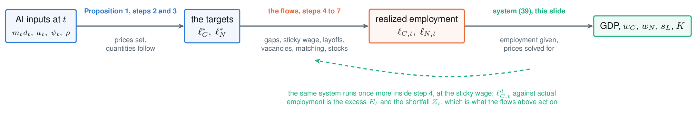

```{r setup, include=FALSE}
knitr::opts_chunk$set(
  echo = TRUE, fig.align = "center",
  fig.width = 10, fig.height = 4.5, dpi = 150,
  message = FALSE, warning = FALSE
)
library(tidyverse)
theme_set(theme_minimal(base_size = 14))

# The model itself is the Python package in the parent directory; this deck reads the
# CSVs it exports (`python3 run.py --csv slides/data`) so no number here is retyped.
paths <- c("modest", "substantial", "extreme") |>
  set_names() |>
  map_dfr(~ read_csv(paste0("data/", .x, ".csv"), show_col_types = FALSE),
          .id = "scenario") |>
  mutate(scenario = factor(scenario, levels = c("modest", "substantial", "extreme")))

# Everything in the CSVs is a log gap against the no-AI path; the paper reports
# percent deviations, exp(x) - 1.
pc  <- function(x) (exp(x) - 1) * 100
r_bar <- 0.115; delta <- 0.05; s_L0 <- 0.60

anchor <- paths |>
  filter(abs(t - 2026.5) < 1e-8) |>
  select(scenario, l_C_2026 = l_C)

d <- paths |>
  left_join(anchor, by = "scenario") |>
  mutate(gdp        = pc(dlnY),
         wage       = pc(dlnw_avg),
         wage_C     = pc(dlnw_C_paid),
         wage_N     = pc(dlnw_N),
         capital    = pc(dlnK),
         tfp        = pc(dln_tfp),
         net_return = 100 * (r_bar * exp(dlnr) - delta),
         lab_share  = 100 * s_L,
         u_all      = 100 * u_rate,
         u_C        = 100 * u_rate_C,
         u_N        = 100 * u_rate_N,
         cog_emp    = 100 * (l_C / l_C_2026 - 1))

scen_cols <- c(modest = "#2a78d6", substantial = "#eb6834", extreme = "#1baf7a")

end_label <- function(p, var, fmt = "%.1f") {
  ends <- d |> filter(abs(t - 2030) < 1e-8)
  p + geom_text(data = ends,
                aes(x = t + 0.06, y = .data[[var]],
                    label = sprintf(fmt, .data[[var]])),
                hjust = 0, size = 3.4, show.legend = FALSE) +
    scale_x_continuous(breaks = seq(2025, 2030, 1)) +
    coord_cartesian(xlim = c(2025, 2030.9), clip = "off")
}

t3 <- read_csv("data/table3.csv", show_col_types = FALSE)

# The exported tables carry the paper's row names. The deck renames the group on display
# only; the CSVs and the Python package keep the paper's wording (see the terminology slide).
relabel <- function(x) {
  x |>
    str_replace("Cognitive", "AI-sensitive") |>
    str_replace("cognitive", "AI-sensitive")
}
```

name: opa-frame
class: center, middle, opa-slide

# An Open Reproduction

.opa-intro[
An independent reproduction of
[Economic Scenarios for Transformative AI](https://www.anthropic.com/institute/econ-scenarios),
following the
[Open Policy Analysis](https://tinyurl.com/1qypbihb) framework.
]


.opa-legend[
**Open Output**: [the explorer](../explorer/), 4374 precomputed combinations of the seven inputs<br>
**Open Analysis**: [the report](../repro.html), and this deck<br>
**Open Materials**: [the repository](https://github.com/fhoces/opa-ai-macro-econ-scenarios),
the model, its tests and every exported CSV
]

.credit[OPA done by [Fernando Hoces de la Guardia](https://fhoces.github.io)]

---
name: deck-map

```{css, echo=FALSE}
.remark-code, .remark-inline-code { font-size: 80%; }
.remark-slide-content { padding: 1em 2em; }
.small { font-size: 80%; }
.tiny { font-size: 65%; }
.small table { font-size: 70%; }
.tiny table { font-size: 62%; width: 100%; }
.remark-slide-content.eqwall { padding: 4px 8px 0; font-size: 66%; }
.remark-slide-content.eqstep { padding: 10px 16px 0; font-size: 108%; }
.remark-slide-content.eq38fit { padding: 0.7em 2em; font-size: 90%; }
.remark-slide-content.figfull { padding: 0.55em 1.2em 0; }
.eqtag {
  position: absolute;
  top: 18px;
  right: 42px;
  font-size: 12px;
  color: #5b6873;
  text-align: right;
  z-index: 100;
}
.eqtag b { color: #1a237e; font-weight: 600; }
.figfull h1 { font-size: 27px; margin: 0 0 7px 84px; }
.fig3 { display: flex; align-items: stretch; gap: 7px; min-height: 612px; }
.fig3 .col { flex: 1; border: 1px solid #d6dbe0; background: #fbfcfd;
             padding: 9px 12px 10px; font-size: 12.5px; line-height: 1.38; }
.fig3 .col h4 { font-size: 14.5px; font-weight: 600; margin: 0 0 6px; }
.fig3 .sub { font-weight: 600; font-size: 11px; letter-spacing: .03em;
             text-transform: uppercase; color: #5b6873; margin: 7px 0 2px; }
.fig3 .sym { font-style: italic; }
.fig3 .arrow { align-self: center; font-size: 24px; color: #9aa6b2; flex: 0 0 auto; }
.fig3 .ser { margin: 4px 0; }
.fig3 .foot { color: #5b6873; margin-top: 7px; display: block; }
.s2p { display: flex; justify-content: flex-start; align-items: flex-start; }
.cols3 { display: flex; gap: 22px; margin-top: 4px; line-height: 1.36; font-size: 92%; }
.cols3 h4 { font-size: 0.62em; font-weight: 600; letter-spacing: .05em; text-transform: uppercase;
            color: #5b6873; margin: 0 0 10px; }
.cols3 .bul { margin: 4px 0; }
.cols3 .em { margin: 5px 0; }
.cols3 .syms { margin-top: 12px; padding-top: 9px; border-top: 1px solid #e2e7ec; }
.cols3 .note { color: #5b6873; margin-top: 12px; display: block; font-size: 0.8em; }
.s2p img { height: 566px; width: auto; max-width: 100%; }
.eqstep .eqnote { font-size: 15px; color: #333; margin: 0 0 6px; }
.eqwall .eqnote { font-size: 15px; color: #333; margin: 0 0 4px 92px; }
.tiny td, .tiny th { padding: 1px 5px 1px 0; }
/* inputs-main: slightly shorter table rows, so the box below ends clear of the
   explorer button and the page number. */
.remark-slide-content.inputs-tight td, .remark-slide-content.inputs-tight th { padding-top: 3px; padding-bottom: 3px; }
.highlight-box {
  background: #fff3e0;
  border-left: 4px solid #e65100;
  padding: 0.5em 1em;
  margin: 0.5em 0;
}
.blue-box {
  background: #e3f2fd;
  border-left: 4px solid #1565c0;
  padding: 0.5em 1em;
  margin: 0.5em 0;
}
.nav-btn {
  position: absolute;
  bottom: 12px;
  left: 40px;
  font-size: 11px;
  background: #e8eaf6;
  padding: 2px 8px;
  border-radius: 3px;
  z-index: 100;
  text-decoration: none;
  color: #1a237e;
}
.nav-btn:hover { background: #c5cae9; }
.nav-btn-br {
  position: absolute;
  bottom: 12px;
  right: 96px;
  font-size: 11px;
  background: #e8eaf6;
  padding: 2px 8px;
  border-radius: 3px;
  z-index: 100;
  text-decoration: none;
  color: #1a237e;
}
.nav-btn-br:hover { background: #c5cae9; }
.inline-btn {
  font-size: 11px;
  background: #e8eaf6;
  padding: 2px 8px;
  border-radius: 3px;
  text-decoration: none;
  color: #1a237e;
  margin-right: 6px;
  vertical-align: middle;
}
.inline-btn:hover { background: #c5cae9; }
a.reflink {
  color: #3b4a5a;
  text-decoration: none;
  border-bottom: 1px dotted #9aa6b2;
}
a.reflink:hover { color: #1a237e; border-bottom-color: #1a237e; }
.site-nav {
  font-size: 11px;
  color: #5b6873;
  margin: 0 0 14px;
}
.site-nav a { color: #1a237e; text-decoration: none; }
.site-nav a:hover { text-decoration: underline; }

/* The opening slide: what this reproduction is, and which OPA layer each artifact
   is. The slide needs its own stacking context or .opa-mark's negative z-index
   drops the figure behind the slide background. */
.remark-slide-content.opa-slide { position: relative; z-index: 0; overflow: hidden; }
.opa-intro { font-size: 92%; max-width: 30em; margin: 0 auto 1.1em; }
.opa-legend { font-size: 85%; line-height: 1.75; max-width: 34em; margin: 0 auto;
              text-align: left; }
.opa-intro a, .opa-legend a { color: #1a237e; }
.opa-mark {
  position: absolute; top: 26px; right: 34px; height: 190px; width: auto;
  opacity: 0.218; z-index: -1; pointer-events: none;
}
/* Author credit, pinned to the slide's lower-left corner, clear of the legend above
   it and of the slide number at the lower right. */
.opa-slide .credit {
  position: absolute; left: 2em; bottom: 14px; font-size: 65%; color: #5b6873;
}
.opa-slide .credit a { color: #1a237e; }
```

.site-nav[
Part of an independent reproduction of Korinek et al. (2026):
[Open Output (the explorer)](../explorer/) &middot; Open Analysis:
[Report](../repro.html) and Slides (here) &middot;
[Open Materials](https://github.com/fhoces/opa-ai-macro-econ-scenarios) &middot;
[Overview](../index.html)
]

# Deck Map

<table style="width:100%; font-size:85%; border-collapse:collapse;">
<tr style="background:#e8eaf6;"><th style="text-align:left; padding:6px;">Part</th><th style="text-align:left; padding:6px;">What it covers</th><th style="padding:6px;">Slides</th></tr>
<tr><td style="padding:6px;"><b>1. The claim</b></td><td style="padding:6px;">What the paper asserts, and the seven inputs it rests on</td><td style="text-align:center;">4&ndash;18</td></tr>
<tr><td style="padding:6px;"><b>2. The model</b></td><td style="padding:6px;">Task-based production, the assignment rule, prices and shares, TFP, the labor share, employment, ideas, unemployment: where every equation comes from</td><td style="text-align:center;">19&ndash;34</td></tr>
<tr><td style="padding:6px;"><b>3. Solving the model for US inputs</b></td><td style="padding:6px;">Calibration, the steady state, all 44 equations and the order they run in, the root-finds</td><td style="text-align:center;">35&ndash;48</td></tr>
<tr><td style="padding:6px;"><b>4. Results: some scenarios and the explorer</b></td><td style="padding:6px;">The three scenarios one at a time, robustness, the survey, what reproduces, takeaways, and two postscripts (the whole grid, AI slop)</td><td style="text-align:center;">49&ndash;61</td></tr>
<tr><td style="padding:6px;"><b>Backup</b></td><td style="padding:6px;">A CES refresher, solving the steady state, month 0 step by step, the 44 equations in the code, five derivations, matching, why slop flips the wage, the pool rounding, growth against levels, the gain <i>a</i></td><td style="text-align:center;">62&ndash;81</td></tr>
</table>

.blue-box[
Every number in this deck comes from an independent Python reimplementation of the
model, which reproduces all 169 cells of the paper's Tables 3, 5 and 6 within tolerance,
153 of them to the printed digit. The deck reads that package's CSV output.
]

---
class: center, middle, inverse

# Part 1: The Claim

---
name: terminology

# A Note on Terminology

The paper divides the workforce into **cognitive** occupations and everyone else, and its
tables carry that label throughout.

.highlight-box[
**This deck does not use it.** The split the model actually makes is between the occupations
whose tasks AI is assumed to affect and those it is not. Calling one side *cognitive* is
inaccurate and demeaning to the work it excludes: it implies the electrician, the home health aide and
the machinist are not thinking, which is false and is not what the model claims. From
here on they are the **AI-sensitive occupations**.
]

.small[
The subscript $C$ stays, because the paper, the reproduction's code and the exported data all
use it: read $\ell_C$, $w_C$ and $u_C$ as employment, the wage and the unemployment rate in
the AI-sensitive group. Tables in this deck are relabelled on display only, so the underlying
data still matches the paper row for row.
]

---
name: claim-table-main

# The Claim, in One Table

```{r claim-table, echo=FALSE}
t3 |>
  filter(row %in% c("GDP, pct above no-AI", "GDP growth, pct per year",
                    "Average wage, pct above no-AI", "cognitive occupations w_C",
                    "Labor share, pct of income",
                    "Cognitive employment, pct since mid-2026",
                    "Unemployment rate, cognitive, pct")) |>
  # The paper's w_C row sits indented under the average wage; on its own here it
  # needs a full name (display only, the CSV row name is unchanged).
  transmute(Outcome = if_else(str_trim(row) == "cognitive occupations w_C",
                              "AI-sensitive wage, pct above no-AI", relabel(str_trim(row))),
            `No AI` = no_ai, Modest = modest,
            Substantial = substantial, Extreme = extreme) |>
  knitr::kable(digits = 1, format = "html")
```

.highlight-box[
The range is the point. Between the modest and extreme scenarios, GDP in 2030 differs
by a factor of twenty, and AI-sensitive unemployment by a factor of six. Both come from
the *same model*: what differs is seven numbers about AI.
]

```{r growth-levels-calc, echo=FALSE}
g0  <- t3 |> filter(row == "GDP growth, pct per year") |> pull(no_ai) / 100
ext <- d |>
  filter(scenario == "extreme", abs(t - round(t)) < 1e-8, t >= 2026, t <= 2030) |>
  arrange(t)

ramp <- ext |>
  transmute(Year             = as.integer(round(t)),
            `AI economy`     = 100 * (g0 + dlnY - lag(dlnY)),
            `No AI`          = sprintf("%.2f", 100 * g0),
            `Excess, pp`     = `AI economy` - 100 * g0,
            `Ratio factor`   = exp(dlnY - lag(dlnY)),
            `Cumulative gap` = gdp)

n        <- nrow(ramp)
start_f  <- exp(ext$dlnY[1])
fac_str  <- paste(sprintf("%.4f", c(start_f, ramp$`Ratio factor`[-1])), collapse = " × ")
prod_val <- sprintf("%.3f", exp(ext$dlnY[n]))
gap_val  <- sprintf("%.1f", ext$gdp[n])
g27      <- sprintf("%.1f", ramp$`AI economy`[2])
g28      <- sprintf("%.1f", ramp$`AI economy`[3])
g30      <- sprintf("%.1f", ramp$`AI economy`[n])
naive    <- sprintf("%.1f", sum(ramp$`Excess, pp`[-1]))

# for the backup slide's log-rate footnote
g30_log  <- ramp$`AI economy`[n] / 100
g30_gross<- sprintf("%.3f", exp(g30_log))
g30_naive<- sprintf("%.3f", 1 + g30_log)
g0_str   <- sprintf("%.3f", g0)
fac30    <- sprintf("%.4f", ramp$`Ratio factor`[n])
start_pc <- sprintf("%.2f", 100 * (start_f - 1))
```

.small[
**Why `r g30`% growth is only a `r gap_val`% level gap.** That is the rate for the twelve
months *ending* in 2030, not an average: the scenario grows `r g27`% in 2027 and `r g28`% in
2028, so `r fac_str` = `r prod_val`.
]

<a href="#growth-vs-levels" class="nav-btn">year by year →</a>

---

name: claim-pictures

# The Claim, in Two Pictures

```{r claim-figure, echo=FALSE, fig.height=3.4}
library(patchwork)

pt <- theme(plot.title = element_text(size = 12), legend.position = "top")

p_gdp <- ggplot(filter(d, t >= 2025), aes(t, gdp, color = scenario)) +
  geom_line(linewidth = 1.2) +
  scale_color_manual(values = scen_cols, name = NULL) +
  labs(x = NULL, y = "percent above the no-AI path", title = "GDP")
p_gdp <- end_label(p_gdp, "gdp") + pt

wd <- d |>
  filter(t >= 2025) |>
  select(t, scenario, `AI-sensitive` = wage_C, `all other` = wage_N) |>
  pivot_longer(-c(t, scenario), names_to = "group", values_to = "w") |>
  mutate(group = factor(group, levels = c("AI-sensitive", "all other")))

p_wage <- ggplot(wd, aes(t, w, color = scenario, linetype = group)) +
  geom_hline(yintercept = 0, linewidth = 0.3, colour = "grey60") +
  geom_line(linewidth = 1.2) +
  ggrepel::geom_text_repel(
    data = filter(wd, abs(t - 2030) < 1e-8),
    aes(label = sprintf("%.1f", w)),
    hjust = 0, nudge_x = 0.35, direction = "y", size = 3.2,
    box.padding = 0.12, seed = 1, min.segment.length = 0,
    segment.size = 0.25, segment.colour = "grey65", show.legend = FALSE) +
  scale_color_manual(values = scen_cols, name = NULL) +
  scale_linetype_manual(values = c("AI-sensitive" = "solid", "all other" = "dashed"),
                        name = NULL) +
  scale_x_continuous(breaks = seq(2025, 2030, 1)) +
  coord_cartesian(xlim = c(2025, 2031.4), clip = "off") +
  guides(color = "none",
         linetype = guide_legend(override.aes = list(colour = "grey35"))) +
  labs(x = NULL, y = NULL, title = "Wages, by job group") +
  pt + theme(legend.key.width = unit(1.3, "cm"))

wC_ext <- sprintf("%.1f", abs(filter(d, scenario == "extreme", abs(t - 2030) < 1e-8)$wage_C))
wN_ext <- sprintf("%.1f", filter(d, scenario == "extreme", abs(t - 2030) < 1e-8)$wage_N)
wA_ext <- sprintf("%.1f", filter(d, scenario == "extreme", abs(t - 2030) < 1e-8)$wage)

wrap_plots(p_gdp, p_wage)
```

.small[
Both panels are gaps against the same economy without AI. Almost all of the divergence
happens after 2027: the scenarios share today's readings and separate only as AI's reach
and use diverge. The average wage rises everywhere, but it hides a split: in the extreme
scenario the average is `r wA_ext`% above the no-AI path while pay in AI-sensitive jobs
ends `r wC_ext`% **below** it and everyone else's ends `r wN_ext`% above.
]

---

# What Kind of Object This Is

.pull-left[
**It is** a mapping:

$$\{m, d, a, \psi, \rho, \mu, \theta_H\} \longrightarrow \{Y, w, s_L, u\}$$

Three assumptions about **how big** AI gets and four about **how disruptively** it
arrives go in; paths for GDP, wages, the labor share and unemployment come out.

The contribution is *comparability*: put anyone's view of AI on the same axes.
]

.pull-right[
**It is not** a forecast.

The paper attaches no probabilities to the three scenarios and says so explicitly.

It also excludes, by construction: catastrophic risk, political economy, AI in
physical tasks, and any feedback from ideas back into AI capability.
]

.blue-box[
Read a scenario as "if you believe *these* seven numbers, you are committed to *those*
outcomes". The interesting work is deciding which numbers you believe.
]

.small[
Section 2.1.2 of the paper calls $m, d, a, \psi, \rho$ the *five exogenous objects*, since
those are the ones entering production; $\mu$ and $\theta_H$ act on the labor market only.
Table 1 splits all seven the way the next slide does: panel B is how big, panel C is how
disruptive.
]

---
name: inputs-main
class: inputs-tight

# The Seven Inputs

| Input | Meaning | Modest | Substantial | Extreme |
|---|---|---|---|---|
| $m_{2030}$ | share of tasks AI can affect | 0.20 | 0.30 | 0.50 |
| $d_{2030}$ | share of those instances actually done with AI | 0.20 | 0.40 | 0.60 |
| $a_{2030}$ | log cost saving per AI-performed instance | 0.30 | 0.45 | 0.80 |
| $\psi$ | share of AI use that is automation, not augmentation | 0.50 | 0.75 | 0.90 |
| $\rho$ | new labor tasks created per task automated | 0.50 | 0.25 | 0 |
| $\mu$ | cross-occupation search efficiency | 0.17 | 0.08 | 0.04 |
| $\theta_H$ | share of the hiring shortfall posted per month | 0.10 | 0.25 | 0.50 |

The first three set **how big** AI is. The last four set **how disruptive** a given
size turns out to be. Two more are held fixed in all three scenarios: the elasticity of
capital supply $\varepsilon = 3$ and the wage-rigidity parameter $\xi = 0.5$, varied
separately in robustness over $\{1, 3, 6, \infty\}$ and $\{0, 0.5, 0.75, 0.9\}$.

.highlight-box[
.small[
**Each of the seven is an empirical quantity with a true value**, and for each one you can say
what data would pin it down. The next seven slides take them one at a time.
]
]

<a href="../explorer/" class="nav-btn-br" target="_blank">the explorer &rarr;</a>

---
name: input-m

# Input 1 of 7: AI's Reach, $m$

.pull-left[
**What it is.** The share of the economy's tasks AI can affect, all of them belonging to the AI-sensitive occupations. Tasks are weighted by their share of base-period labor payments, not by headcount, so $m$ is a share of the wage bill. It follows a logistic curve.

**Watch the denominator.** $m$ is a share of *all* work, not of AI-sensitive work. Its ceiling is $\bar m = 0.624$, the AI-sensitive share of employment, and Table A.2 gives the conversion: the affected share of those occupations' own tasks is $m / 0.624$. So $m = 0.50$ is four fifths of what they do today, not half.

**Where the scenarios put it.** A mid-2026 anchor of **0.14** shared by all three, rising to **0.20 / 0.30 / 0.50** by 2030.
]

.pull-right[
**What is measured today.** The 2026 anchor is an observed-exposure measure (Massenkoff–McCrory 2026). That number is an estimate, not an assumption.

**What would settle it.** Task-level capability evaluations mapped onto an occupational task taxonomy, then reweighted by wage-bill shares rather than task counts. The survey asked 10,980 adults which of eight knowledge-work tasks AI will do as well as a professional by 2030: median **0.44**.
]

.highlight-box[
.small[
**Status:** anchored to data in 2026, assumed in 2030. The gap between 0.20 and 0.50 is the single largest unmeasured quantity in the model.
]
]


---
name: input-d

# Input 2 of 7: Adoption, $d$

.pull-left[
**What it is.** Of the tasks AI can do, the share of instances actually performed with AI. It never enters alone: $m \times d$ is the share of *all* instances done with AI, which is $0.50 \times 0.60 = 30\%$ by 2030 in the extreme scenario.

**Where the scenarios put it.** A mid-2026 anchor of **0.10** shared by all three, rising to **0.20 / 0.40 / 0.60** by 2030.
]

.pull-right[
**What is measured today.** The anchor comes from the Census BTOS AI supplement, **adjusted down from firm shares**: BTOS asks whether a firm uses AI, which is not the same as the share of instances done with AI.

**What would settle it.** Instance-level usage rather than firm-level adoption. This is the input where the measured proxy and the modelled object differ most, and where usage telemetry could close the gap fastest. Survey median **0.40**.
]

.highlight-box[
.small[
**Status:** a proxy is measured, the exact object is not. The adjustment from firm shares to instance shares is itself a judgement call.
]
]


---
name: input-a

# Input 3 of 7: The Gain, $a$

.pull-left[
**What it is.** A *log* saving on the unit cost of one instance done with AI, equivalently a log speed-up: $a = 0.80$ means a task that took 100 minutes takes 45. It applies whether a worker does the instance with AI or capital does it outright.

**Where the scenarios put it.** **0.30 / 0.45 / 0.80** by 2030, on a straight line rather than a logistic, from anchors that differ by scenario (0.30 / 0.35 / 0.45).
]

.pull-right[
**What is measured today.** Nothing anchors the 2030 level. The survey asked how long an AI-suited task takes with AI versus without: median **0.44**, a cut of about a third.

**What would settle it.** Randomized task-level productivity experiments, which already exist for a handful of occupations. Of the seven this is the **cheapest to measure directly**, though published estimates are short-run and cover few tasks.
]

.highlight-box[
.small[
**Status:** assumed, but experimentally measurable. Note it says nothing about jobs: whether the instance still employs a person is $\psi$, not $a$.
]
]

<a href="#gain-detail" class="nav-btn">the survey's plain-language version &rarr;</a>


---
name: input-psi

# Input 4 of 7: Automation Share, $\psi$

.pull-left[
**What it is.** Of AI use, the share that replaces the worker on that instance rather than assisting them. This is the input that separates productivity from distribution: it moves the labor share while leaving measured TFP almost unchanged.

**Where the scenarios put it.** **0.50 / 0.75 / 0.90**, held constant over time within each scenario.
]

.pull-right[
**What is measured today.** The low end comes from the Anthropic Economic Index automation-versus-augmentation split of observed usage: about half of chat use and three quarters of API use looks like automation. The 0.9 end is an assumed world where agentic use dominates. Of the four disruptiveness inputs, this has the best contemporaneous data.

**What would settle it.** Classifying observed AI interactions by whether a human stays in the loop, weighted to the economy rather than to the users of one product. Survey median **0.47**, close to the modest scenario's 0.50.
]

.small[
**There is no separate augmentation input.** Augmentation is $1 - \psi$, and it delivers the
*same* cost saving $a$: the paper applies it whether a worker performs the instance with AI
or capital does it outright (p. 11). So "what if AI mostly helps people rather than
replacing them" means lowering $\psi$, not raising some other input. Over $\psi$ from 0
to 1, wider than any scenario uses, measured TFP moves only
**3.02 to 3.09**, while the labor share moves **59.7 to 54.9** and AI-sensitive employment
**−1.1% to −4.9%**. GDP does rise over that range (4.5 to 9.5), but through capital
deepening, not productivity.
]

.highlight-box[
.small[
**Status:** a range anchored to usage data, a point value assumed. Moving it across the paper's own 0.50-0.90 range shifts the labor share from 57.3 to 55.4 percent while TFP moves only 3.06 to 3.09.
]
]


---
name: input-rho

# Input 5 of 7: Reinstatement, $\rho$

.pull-left[
**What it is.** New labor tasks created for each task automated. At 1 displacement is exactly offset, at 0 nothing comes back. New tasks go to the AI-sensitive occupations and enter at the same unit cost, so they offset displacement one for one in the affected wage bill.

**Where the scenarios put it.** **0.50 / 0.25 / 0.00**. Nothing in the paper's scenarios goes above 0.5.
]

.pull-right[
**What is measured today.** The 0.5 comes from the Acemoglu–Restrepo (2019) decomposition for 1987-2017, which is **historical and not about AI**; 0 is an assumption. It was not asked in the survey.

**What would settle it.** Nothing available today. You cannot measure tasks that do not exist yet, and a technology mid-diffusion offers no contemporaneous read. Only historical analogues, from a different technology.
]

.highlight-box[
.small[
**Status:** the **least identified** of the seven, and the second-strongest of the four disruptiveness inputs: moved alone it shifts 2030 AI-sensitive unemployment by 1.35 points across the paper's range, behind search efficiency $\mu$ at 1.47 and ahead of $\psi$ at 0.76. More if you allow full offset.
]
]


---
name: input-mu

# Input 6 of 7: Search Efficiency, $\mu$

.pull-left[
**What it is.** How easily a displaced worker finds work in another occupation, as a discount on normal-times search. Lower is worse. It is arguably a labor-market **institution** rather than a fact about AI.

**Where the scenarios put it.** **0.17 / 0.08 / 0.04**, against a normal-times value of 0.17.
]

.pull-right[
**What is measured today.** The normal-times value is well measured: IPUMS-CPS matched monthly 2010–19, the Carrillo-Tudela & Visschers (2023) occupational switching matrix, JOLTS, CPS 2025.

**What would settle it.** The baseline needs nothing further. What is assumed is how much harder reallocation becomes under a shock with no precedent. The survey asked how long re-employment would take against a three-month normal: median about eight months, implying **0.064**.
]

.highlight-box[
.small[
**Status:** baseline measured, shock response assumed. Hold everything else at the extreme setting and put this back to its normal-times 0.17 and you get the highest-GDP cell in the whole grid.
]
]


---
name: input-theta

# Input 7 of 7: Posting Speed, $\theta_H$

.pull-left[
**What it is.** The share of the hiring shortfall that firms post as vacancies each month. It governs how *quickly* the labor market works through the reallocation rather than how large the reallocation is.

**Where the scenarios put it.** **0.10 / 0.25 / 0.50** per month.
]

.pull-right[
**What is measured today.** Normal-times vacancy behaviour is measured from JOLTS, alongside the employment-weighted fill rate of 0.65 and the matching curvature of 1.27 from den Haan et al. (2000).

**What would settle it.** As with $\mu$, the baseline is measured and the scenario values are guesses about the speed of adjustment under an unprecedented shock. Not asked in the survey.
]

.highlight-box[
.small[
**Status:** baseline measured, scenario values assumed. It is the **weakest of the four disruptiveness inputs**: moved alone it shifts 2030 AI-sensitive unemployment by 0.66 points. Of all seven inputs only the gain $a$ moves it less, by 0.24.
]
]

---

# Two Ways to Read the Rest

.pull-left[
**Stop after the next slide and use it.**

Everything so far treats the model as a box: seven numbers in, four paths out. The next slide is
that box on one page, what goes in, what happens inside, what comes out. After it you have
enough to put your own view of AI on the same axes as the paper's three, which is what the
explorer is for.

<a href="../explorer/" class="inline-btn" target="_blank">set the inputs yourself &rarr;</a>
]

.pull-right[
**Or open the box.**

**Part 2** is the model itself, equation by equation: how tasks become output, why the labor
share moves without productivity moving, where unemployment comes from, and which assumptions
are carrying the results. **Part 3** then solves those equations for US inputs: the calibration,
the steady state, all 44 equations and the order they run in.
]

.blue-box[
Nothing after this slide changes a number you have already seen. It explains where those
numbers come from, and which of them you should be least willing to believe.
]

---
class: figfull
name: whole-model

# The Model on One Page

<div class="fig3">

<div class="col" style="flex:1.55; border-left:4px solid #2a78d6;">
<h4>1 &nbsp;What goes in</h4>

<div class="sub">Measured, and held fixed: the US economy as it is</div>
Production and prices: <span class="sym">&sigma;</span>, <span class="sym">s<sub>L,t0</sub></span>,
<span class="sym">s<sub>C,t0</sub>/s<sub>L,t0</sub></span>, <span class="sym">r&#772;</span>,
<span class="sym">&delta;</span><br>
Labor market: <span class="sym">U&#772;</span>, <span class="sym">q&#772;<sub>C</sub></span>,
<span class="sym">q&#772;<sub>N</sub></span>, <span class="sym">&mu;&#772;</span>,
<span class="sym">&iota;</span>, <span class="sym">&pi;&#772;</span>,
<span class="sym">&#8467;<sub>C,t0</sub></span>, <span class="sym">&#8467;<sub>N,t0</sub></span>,
<span class="sym">L</span><br>
Ideas: <span class="sym">1&minus;&phi;<sub>R</sub></span>, <span class="sym">&lambda;</span>,
<span class="sym">g</span>, <span class="sym">n</span>, <span class="sym">&iota;<sub>R</sub></span><br>
Where AI stands in mid-2026: <span class="sym">m<sub>2026</sub></span>,
<span class="sym">d<sub>2026</sub></span><br>
Grid: <span class="sym">t<sub>0</sub></span>, <span class="sym">h</span><br>
<span class="foot">Two of these are assumptions rather than measurements, and the paper varies
them in robustness instead of by scenario: <span class="sym">&epsilon;</span>, how much capital
answers a higher return, and <span class="sym">&xi;</span>, how sticky the AI-sensitive wage is.</span>

<div class="sub" style="color:#2a78d6;">Assumed about AI, and yours to move in the explorer</div>
<span class="sym">m</span> how much of the work AI can touch &middot;
<span class="sym">d</span> how much of that is actually done with AI &middot;
<span class="sym">a</span> how much cheaper each AI-done task is &middot;
<span class="sym">&psi;</span> how much of that use replaces rather than assists &middot;
<span class="sym">&rho;</span> how many new tasks appear per task automated &middot;
<span class="sym">&mu;</span> how easily a displaced worker crosses occupations &middot;
<span class="sym">&theta;<sub>H</sub></span> how fast firms post the vacancies
<span class="foot">Nothing here is estimated. These seven are the whole content of a scenario.</span>
</div>

<div class="arrow">&rarr;</div>

<div class="col" style="flex:1.5; border-left:4px solid #eb6834;">
<h4>2 &nbsp;What happens inside</h4>

<div class="sub">The one agent that optimizes</div>
<b>Firms minimize cost, instance by instance.</b> Work is a continuum of task instances, and each
one goes to whichever is cheapest: a worker, a worker with AI, or capital doing it outright. Output
aggregates them with elasticity <span class="sym">&sigma;</span> below one, so tasks are
<b>complements</b>: cheapening some raises the value of the rest. Firms pay the marginal product
and post vacancies to fill what they want.

<div class="sub">Where the frictions are</div>
<b>Reallocation is slow.</b> Two occupation groups; a displaced worker counts fully at home and
only <span class="sym">&mu;</span> away; hires come from a matching function that can never
exceed searchers or vacancies; quits respond to how easy finding work is; layoffs only when
demand falls short of the payroll; the AI-sensitive wage closes a fraction
1&minus;<span class="sym">&xi;</span> of its gap to the clearing level each year, about 6 percent a month.<br>
<b>Capital answers prices, not a plan.</b> Supply is a schedule with elasticity
<span class="sym">&epsilon;</span>.<br>
<b>Ideas accumulate.</b> A share of GDP goes to research, and each new idea is harder to find
than the last (fishing-out, <span class="sym">1&minus;&phi;<sub>R</sub></span> = 2.86).

<div class="sub">What the model is not</div>
<span class="foot">Nobody is forward-looking. There is no household Euler equation, no
expectations about AI, no policy. Every month is solved on its own and handed to the next, monthly
from 2024 to 2030.</span>
</div>

<div class="arrow">&rarr;</div>

<div class="col" style="flex:1.05; border-left:4px solid #1baf7a;">
<h4>3 &nbsp;What comes out</h4>
<div class="ser">GDP</div>
<div class="ser">measured TFP</div>
<div class="ser">the average wage</div>
<div class="ser">the AI-sensitive wage</div>
<div class="ser">the all-other wage</div>
<div class="ser">the labor share of income</div>
<div class="ser">the capital stock</div>
<div class="ser">employment, by group</div>
<div class="ser">unemployment, by group and overall</div>
<div class="ser">workers changing occupation</div>
<div class="ser">the stock of ideas</div>
<span class="foot">Each one monthly, and each one a <b>gap against the same economy without
AI</b>, never a forecast of the level.</span>

<a href="../explorer/" class="inline-btn" target="_blank" style="margin-top:8px; display:inline-block;">set the seven yourself &rarr;</a>
</div>

</div>

---
name: part2-divider
class: center, middle, inverse

# Part 2: The Model

Why the labor share can fall while productivity barely moves, and where unemployment comes from.

---
name: tasks-main

# Production: Tasks, Not Factors

<div class="eqtag">yields <b>(1)</b> and <b>(2)</b></div>

$$Y_t = \Big[ \sum_i \omega_i^{1/\sigma} y_{i,t}^{(\sigma-1)/\sigma} \Big]^{\sigma/(\sigma-1)} \;\; \text{(1)}, \qquad y_{i,t} = A_t \alpha_{L,i,t} \ell_{i,t} + \alpha_{K,i,t} k_{i,t} \;\; \text{(2)}$$

- A **task** is a type of work (reviewing a contract); an **instance** is one
  performance of it. The CES runs over instances.
- Within an instance, labor and capital are **perfect substitutes**: whoever is
  cheaper does this contract.
- Across instances they are **gross complements**, $\sigma = 0.5$.

.highlight-box[
This is the departure from the aggregate production function. Automation is not a
change in an exponent; it is a set of tasks changing hands. That distinction is what
lets the model separate "AI makes us productive" from "AI takes the work".
]

<a href="#ces-refresher" class="nav-btn">CES refresher →</a>

---
name: assignment-main

# Who Does Each Instance

<div class="eqtag">yields <b>(3)</b></div>

$$p_{i,t} = c_{i,t} = \min\Big\{ \frac{w_t}{A_t \alpha_{L,i,t}}, \; \frac{r_t}{\alpha_{K,i,t}} \Big\} \;\; \text{(3)}$$

Rank instances by capital's comparative advantage $\alpha_K / \alpha_L$. The
assignment is a **threshold rule**: everything above the cutoff goes to machines,
everything below to people, and the cutoff moves with $r_t / w_t$.

--

AI enters by moving $\alpha$'s:

- **Automation**: raise $\alpha_{K,i}$ enough that capital takes the instance at the
  pre-AI rental rate.
- **Augmentation**: raise $\alpha_{L,i}$ so the worker keeps it and is faster.

Both cut that instance's unit cost by the same $a_{i,t}$ log points.

<a href="#assignment-derivation" class="nav-btn">where this comes from &rarr;</a>

---
name: fork-main

# The Fork That Does the Distributional Work

<div class="eqtag">defines &psi;, which enters <b>(14)</b> and <b>(15)</b></div>

.pull-left[
**Same effect on productivity**

An automated instance and an augmented instance are equally cheap afterwards. Measured
TFP cannot tell them apart.
]

.pull-right[
**Opposite effect on labor**

The automated instance takes its whole wage bill to capital. The augmented one leaves
it with labor.
]

$$\psi_t = \text{share of AI-performed instances that are automated} \;\; \text{(--)}$$

.blue-box[
$\psi$ is absent from the TFP equation and central to the labor-share equation. That
single asymmetry is why the paper can produce "GDP up 32 percent, AI-sensitive wage down
11 percent" without any market failure.
]

.small[
Both equations arrive shortly; jump ahead if you want to see the asymmetry before the
argument that builds to it.
]

<a href="#tfp-main" class="nav-btn">the TFP equation &rarr;</a>
<a href="#labor-share-main" class="nav-btn-br">the labor-share equation &rarr;</a>

---
name: shares-main

# Prices, Shares, and Why $\sigma < 1$ Is the Whole Story

<div class="eqtag">yields <b>(4)</b> and <b>(5)</b></div>

$$s_{i,t} = \omega_i \Big(\frac{c_{i,t}}{P_t}\Big)^{1-\sigma} \;\; \text{(4)}, \qquad P_t \equiv 1$$

With $\sigma < 1$ the exponent $1-\sigma$ is **positive**: a task that gets cheaper (its
unit cost $c_{i,t}$ falls, so with the exponent positive $(c_{i,t}/P_t)^{1-\sigma}$ falls with
it) takes a *smaller* share of spending, because quantity rises less than the price falls.

--

Two consequences used repeatedly:

1. Tasks labor keeps become the expensive ones, so spending tilts toward them. This
   *cushions* the labor share.
2. When the rental rate rises, spending tilts toward capital's instances, which *cuts*
   the labor share.

$P_t \equiv 1$ is a constraint, not a definition: if AI lowers some costs, some other
price must rise. That is how productivity becomes factor income.

<a href="#share-derivation" class="nav-btn">derivation →</a>

---
name: tfp-main

# Productivity: Hulten and Domar Weights

<div class="eqtag">yields <b>(9)</b>, exact form <b>(45)</b></div>

$$\Delta \ln \mathrm{TFP}_t \approx \sum_i \omega_i d_{i,t} a_{i,t} = s_{L,t0}\, m_t d_t a_t \;\; \text{(9)}$$

Hulten's theorem: the aggregate gain is the sum of micro cost reductions weighted by
**Domar weights** (sales over GDP). You do not need the network structure, only sizes
and cost declines.

```{r hulten-check, echo=TRUE}
# Substantial scenario, 2030: m = 0.30, d = 0.40, a = 0.45
0.60 * 0.30 * 0.40 * 0.45      # first-order TFP gain, matches the paper's 0.032
```

.highlight-box[
$s_{L,t0} = 0.6$ appears as a **unit conversion**, not a behavioural claim: task sizes
are measured against the wage bill, and this converts them to shares of GDP.
Note what is missing: $\psi$ and $\rho$.
]

---

name: frontier-main

# Who Gets the Gain: the Factor-Price Frontier

<div class="eqtag">yields <b>(10)</b> and <b>(11)</b></div>

$$s_{L,t0}\, \Delta \ln w_t + s_{K,t0}\, \Delta \ln r_t \approx s_{L,t0}\, m_t d_t a_t \;\; \text{(10)}$$

The Solow residual read backwards. Factor payments exhaust output, so the whole
productivity gain must leave as higher wages or a higher return.

--

.pull-left[
If capital is **elastic**, $r$ barely moves and labor gets nearly all of it:
$\Delta \ln w \approx m d a$.
]

.pull-right[
Every percent that $r$ rises costs the wage
$s_{K,t0}/s_{L,t0} = 2/3$ percent.
]

The wage falls below its no-AI path exactly when
$s_{K,t0}\Delta \ln r_t > s_{L,t0} m_t d_t a_t$: capital's claim exceeds the gain
being shared.

---

name: capital-supply

# The Input That Decides: Capital Supply

<div class="eqtag">yields <b>(6)</b>, threshold <b>(12)</b></div>

$$\Delta \ln K_t = \varepsilon\, \Delta \ln r_t \;\; \text{(6)}$$

```{r eps-table, echo=FALSE}
read_csv("data/table5.csv", show_col_types = FALSE) |>
  filter(scenario == "substantial",
         row %in% c("GDP, pct above no-AI", "Average wage, pct above no-AI",
                    "Labor share, pct of income")) |>
  select(row, eps, simulated) |>
  pivot_wider(names_from = eps, values_from = simulated, names_prefix = "eps = ") |>
  knitr::kable(digits = 1, format = "html")
```

.blue-box[
Same AI, same displacement: only the elasticity of capital supply changes. The average
wage swings from **−1.6 percent to +5.6 percent**. Whether AI is good for workers in
this model is substantially a question about the supply of capital.
]

<a href="#epsstar-derivation" class="nav-btn">when does the wage fall? →</a>

---
name: labor-share-main

# The Labor Share: Three Channels

<div class="eqtag">the first-order form of <b>(14)</b>, third line of <b>(11)</b></div>

$$\Delta \ln s_{L,t} \approx -\underbrace{(1-\rho)\psi_t m_t d_t}_{\text{displacement}} + \underbrace{(1-\sigma)\psi_t m_t d_t a_t}_{\text{weak link}} - \underbrace{(1-\sigma)\tfrac{s_{K,t0}}{s_{L,t0}}\Delta \ln r_t}_{\text{dearer capital}} \;\; \text{(11)}$$

1. **Displacement.** An automated instance moves its *entire* wage bill to capital,
   however small the cost saving. Reinstatement gives back a fraction $\rho$.
2. **Weak link.** The instances labor keeps are now the expensive ones, and with
   $\sigma < 1$ spending tilts toward them. This works *for* labor.
3. **Dearer capital.** The same complementarity works *against* labor when the rental
   rate rises.

In the extreme scenario the first channel wins outright: the labor share falls from
60 to 45 percent in six years.

<a href="#labor-share-derivation" class="nav-btn">derivation →</a>

---

name: employment-main

# Employment: Solve the Group AI Does Not Touch

<div class="eqtag">yields <b>(13)</b></div>

$$\tilde \ell_{N,t} = \Delta \ln (Y_t/L_t) - \sigma \Delta \ln w_t \;\; \text{(13)}$$

Home health aides and electricians are unaffected, so demand for that labor is an ordinary
CES demand: up one-for-one with output, down with its own price at elasticity
$\sigma$.

Labor supply is fixed, so whatever $N$ gains, $C$ loses:

$$\frac{\ell_{C,t0} - \ell^*_{C,t}}{\ell_{C,t0}} = \frac{s_{N,t0}}{s_{C,t0}} \cdot \frac{\ell^*_{N,t} - \ell_{N,t0}}{\ell_{N,t0}}, \qquad \frac{s_N}{s_C} = 0.60 \;\; \text{(13)}$$

.highlight-box[
Because AI-sensitive occupations are the *larger* group, their proportional decline is
smaller than the other group's rise, and much smaller than the rise in GDP. In the
extreme scenario GDP is up 32 percent while AI-sensitive employment is down 21 percent.
]

---
name: prop1-main

# Proposition 1: the Exact Solution

<div class="eqtag">yields <b>(14)</b>, <b>(15)</b>, <b>(16)</b>, <b>(18)</b></div>

$$s_{L,t} = 1 - \big[ s_{K,t0} + s_{L,t0} \psi_t m_t d_t ( e^{-(1-\sigma)a_t} - \rho ) \big] e^{(1-\sigma)\Delta \ln r_t} \;\; \text{(14)}$$

$$\tilde \ell_{N,t} = -\ln \big( 1 - m_t d_t [ 1 - \rho \psi_t - (1-\psi_t) e^{-(1-\sigma)a_t} ] \big) \;\; \text{(15)}$$

$$\Delta \ln w_t = \frac{\Delta \ln s_{L,t} + \tilde \ell_{N,t}}{1-\sigma} + \Delta \ln A_t \;\; \text{(16)}, \qquad \varepsilon \Delta \ln r_t = \Delta \ln K_t \;\; \text{(18)}$$

Everything above was first-order intuition. This is the closed form the simulation
actually runs, and it matters: in the extreme scenario the first-order approximation
misses TFP by a fifth.

.blue-box[
Solution strategy: the last equation is one monotone equation in one unknown
$\Delta \ln r_t$. Solve it by bisection, and every other variable follows in order.
No simultaneous system.
]

<a href="#prop1-derivation" class="nav-btn">where each line comes from →</a>

---

name: growth-main

# Does AI Raise the Growth Rate?

<div class="eqtag">yields <b>(20)</b> to <b>(22)</b>, <b>(42)</b></div>

$$\dot A_t = \nu R_t^{\lambda} A_t^{\phi_R}, \qquad R_t = \iota_{R,t} Y_t, \qquad \Delta \ln R_t = \Delta \ln Y_t \;\; \text{(20) to (22)}$$

Semi-endogenous growth, Jones (1995). Research uses final output ("lab equipment"), so
a richer economy mechanically buys more research.

--

$$\Delta g_t = g \big[ e^{\lambda \Delta \ln R_t - (1-\phi_R)\Delta \ln A_t} - 1 \big] \;\; \text{(42)}$$

The leading $g$ is the punchline. The bracket is a *proportional* gap in a growth rate
that is only 1.67 percent a year, so a research uplift of 0.28 log points adds a fraction of a
percentage point, not 28 points.

```{r ideas-numbers, echo=FALSE}
d |> filter(abs(t - 2030) < 1e-8) |>
  transmute(scenario, `research uplift, log pts` = round(dlnR, 3),
            `ideas stock, pct above no-AI` = round(pc(dlnA), 2),
            `idea growth, pct per year` = round(1.67 + 100 * (dlnA - lag(dlnA, 0)), 2)) |>
  select(-`idea growth, pct per year`) |>
  knitr::kable(format = "html")
```

---

name: growth-small

# Why the Growth Channel Stays Small

<div class="eqtag">no new equation: the magnitudes</div>

.pull-left[
**Level channel** (Section 2.1)

Extreme scenario, 2030: GDP **+32.4 percent**.

Immediate, and the whole story over six years.
]

.pull-right[
**Growth channel** (Section 2.2)

Extreme scenario, 2030: ideas stock **+0.61 percent**.

In the long run the ideas stock would settle about 10 percent higher, because each 1 percent
more research eventually buys $\gamma = \lambda/(1-\phi_R) = 0.35$ percent more ideas (0.28 log
points of extra research times 0.35 is about 10 percent). Getting there takes decades.
]

.highlight-box[
Over a six-year horizon the innovation block is nearly a rounding error. Over fifty
years it would not be. The paper is explicit that recursive self-improvement is
*hard-coded into* $a_t$ rather than modelled, which is where a reader who cares about
fast takeoff should push.
]

---

name: unemployment-main

# Unemployment: Why It Exists Here

<div class="eqtag">yields <b>(27)</b> to <b>(31)</b></div>

Two frictions, and both are needed:

1. **A wage that falls too slowly.** The AI-sensitive discount to the common wage closes
   only a fraction $1 - \xi$ of its gap per year (Blanchard–Galí form).
2. **Search that takes time.** Displaced workers must find jobs in the other group,
   and cross-occupation search is discounted by $\mu$.

--

$$D_{C,t} = \max\{0, E_t - q_{C,t}\ell_{C,t}\}, \qquad E_t = \max\{0, \ell_{C,t} - \ell^d_{C,t}\} \;\; \text{(31)}$$

With the wage above market clearing, firms want fewer AI-sensitive workers than are
attached to the group. Quits absorb part of the gap; **layoffs** remove the rest.

.blue-box[
This is job rationing (Michaillat 2012), not just frictional unemployment: some jobs
are not offered *because the wage is too high*, which is exactly why the $\xi$
robustness table trades wage declines against unemployment.
]

---
name: matching-main

# Matching

<div class="eqtag">yields <b>(33)</b> to <b>(37)</b></div>

$$H_{j,t} = \chi \frac{S_{j,t} v_{j,t}}{(S_{j,t}^{\iota} + v_{j,t}^{\iota})^{1/\iota}} \;\; \text{(34)}, \qquad S_{C,t} = U_{C,t} + \mu U_{N,t} \;\; \text{(33)}$$

$$\ell_{o,t+1} = (1 - q_{o,t})\ell_{o,t} - D_{o,t} + H_{o,t} \;\; \text{(36)}, \qquad U_{o,t+1} = U_{o,t} + q_{o,t}\ell_{o,t} + D_{o,t} - f_{o,t}U_{o,t} \;\; \text{(37)}$$

Not Cobb-Douglas. The den Haan–Ramey–Watson form guarantees
$H \le \min\{S, v\}$ automatically, so no cap and no kinks in the simulated paths.
That matters here because the extreme scenario pushes the ratios far from normal.

The cross-group discount $\mu$ carries all the occupational human capital in the
model: a laid-off paralegal is not instantly an electrician.

.blue-box[
$\mu$ and $\theta_H$ are the two inputs that convert a given amount of *reallocation*
into a given amount of *unemployment*. They are also the two the paper can least
defend from data, since no episode of AI displacement exists to estimate them from.
]

<a href="#matching-detail" class="nav-btn">why not Cobb-Douglas →</a>

---
name: part2-output

# What Part 2 Produced

.small[
Part 2 never touched a US number. What it produced is a closed set of equations, and Part 3 does
exactly one thing with them: put the measured US economy in and turn the crank.

| Block | Equations | What they pin down |
|---|---|---|
| Production and assignment | (1), (2), (3) | output from task instances, and who does each one |
| Prices and shares | (4), (5) | expenditure shares at the new unit costs, the labor share's definition |
| Productivity | (9), (45) | measured TFP, to first order and exactly |
| Who gets the gain | (10), (11), (12) | the factor-price frontier, and when the wage falls |
| Capital | (6) | supply answering the return with elasticity $\varepsilon$ |
| The frictionless economy | (13) to (19) | the labor share, the wage, output, capital, the employment **targets** |
| Ideas | (20) to (22), (24), (40) to (43) | research, fishing-out, the growth gap |
| The labor market | (27) to (37) | quits, layoffs, vacancies, matching, and the two stocks |
| Normal times | (38) | the same flow equations at rest, solved once in Part 3 |
| The actual economy | (39) | prices at realized rather than frictionless employment |
]

.highlight-box[
.small[
Two things are worth noticing about that list. **Nothing in it is estimated**: every equation is
an accounting identity, a cost-minimisation, or a rule the paper writes down. And **only two rows
of it are implicit**, (18) and (39), which is why Part 3 can solve the whole month in order with
two one-dimensional root-finds instead of a simultaneous system.
]
]

---
class: center, middle, inverse

# Part 3: Solving the Model for US Inputs

---
class: figfull
name: theory-map

# The Model in One Page: More Detail

<div class="fig3">

<div class="col" style="flex:1.55; border-left:4px solid #2a78d6;">
<h4>1 &nbsp;What goes in</h4>

<div class="sub">Measured, and held fixed</div>
Production and prices: <span class="sym">&sigma;</span> = 0.5,
<span class="sym">s<sub>L,t0</sub></span> = 0.60,
<span class="sym">s<sub>C,t0</sub>/s<sub>L,t0</sub></span> = 0.624,
<span class="sym">r&#772;</span> = 11.5%, <span class="sym">&delta;</span> = 5%<br>
Labor market: <span class="sym">U&#772;</span> = 3.8%, <span class="sym">q&#772;</span> = 0.11/yr,
&times;0.69 for AI-sensitive and &times;1.52 for all other, of which 55% responds to how easy
finding work is, <span class="sym">&mu;&#772;</span> = 0.17,
<span class="sym">&iota;</span> = 1.27, mean <span class="sym">&pi;&#772;</span> = 0.65,
<span class="sym">&#8467;<sub>C,t0</sub></span> = 0.600,
<span class="sym">&#8467;<sub>N,t0</sub></span> = 0.362, <span class="sym">L</span> = 1<br>
Ideas: <span class="sym">1&minus;&phi;<sub>R</sub></span> = 2.86,
<span class="sym">&lambda;</span> = 1, <span class="sym">g</span> = 1.67%,
<span class="sym">n</span> = 0.33%, <span class="sym">&iota;<sub>R</sub></span> = 3.5% rising 2.8%/yr<br>
AI in mid-2026: <span class="sym">m<sub>2026</sub></span> = 0.14,
<span class="sym">d<sub>2026</sub></span> = 0.10, ceilings
<span class="sym">m&#772;</span> = 0.624, <span class="sym">d&#772;</span> = 1<br>
Grid: <span class="sym">t<sub>0</sub></span> = 2024, then 2026.5 and 2030,
<span class="sym">h</span> = 1/12
<span class="foot">Varied only in robustness, not by scenario:
<span class="sym">&epsilon;</span> = 3 and <span class="sym">&xi;</span> = 0.5.</span>

<div class="sub" style="color:#2a78d6;">The seven, modest / substantial / extreme in 2030</div>
<span class="sym">m</span> 0.20 / 0.30 / 0.50 &middot;
<span class="sym">d</span> 0.20 / 0.40 / 0.60 &middot;
<span class="sym">a</span> 0.30 / 0.45 / 0.80 &middot;
<span class="sym">&psi;</span> 0.50 / 0.75 / 0.90 &middot;
<span class="sym">&rho;</span> 0.50 / 0.25 / 0.00 &middot;
<span class="sym">&mu;</span> 0.17 / 0.08 / 0.04 &middot;
<span class="sym">&theta;<sub>H</sub></span> 0.10 / 0.25 / 0.50
<span class="foot">Each one a path from its anchor to that 2030 value by <b>(8)</b>: logistic for
<span class="sym">m</span> and <span class="sym">d</span>, a straight line for
<span class="sym">a</span>, constant for the rest.</span>
</div>

<div class="arrow">&rarr;</div>

<div class="col" style="flex:1.5; border-left:4px solid #eb6834;">
<h4>2 &nbsp;What happens inside, by equation</h4>

<div class="sub">Once, before the first month</div>
The steady state <b>(38)</b>: nine normal-times objects, of which
<span class="sym">&chi;</span>, <span class="sym">&pi;&#772;<sub>o</sub></span>,
<span class="sym">H&#772;<sub>o</sub></span> and <span class="sym">f&#772;<sub>o</sub></span>
become constants and <span class="sym">U&#772;<sub>o</sub></span> the starting pools.

<div class="sub">Then 73 months, 2024 to 2030: the 44 equations of Table A.1</div>
<b>A ideas</b> (3 rows): <b>(20)</b> to <b>(22)</b>, <b>(42)</b>, <b>(43)</b><br>
<b>B capital, wage, shares, targets</b> (9 rows): <b>(14)</b> to <b>(18)</b> and
<b>(45)</b>, the frictionless targets from <b>(13)</b> and <b>(15)</b><br>
<b>C flows</b> (23 rows): quits <b>(27)</b>, gaps <b>(28)</b>, attached force <b>(29)</b>,
sticky wage <b>(30)</b>, layoffs <b>(31)</b>, vacancies <b>(32)</b>, search <b>(33)</b>,
hires <b>(34)</b>, finding rates <b>(35)</b>, stocks <b>(36)</b> and <b>(37)</b><br>
<b>D reporting</b> (9 rows): the actual economy <b>(39)</b> at realized employment, plus
<span class="sym">u<sup>x</sup></span>, <span class="sym">X</span>,
<span class="sym">G</span> and <b>(19)</b>

<div class="sub">Why it can be solved in order</div>
Every row but two depends only on constants, exogenous paths, last month's state, or a row
already done. The two exceptions are <b>(18)</b>, the capital market, and <b>(39)</b>, the
actual economy, and both are one monotone equation in
<span class="sym">&Delta;ln r</span>. Four bisections a month, no solver library.
<span class="foot">Each month hands the next eight numbers on:
<span class="sym">&#8467;<sub>C</sub></span>, <span class="sym">&#8467;<sub>N</sub></span>,
<span class="sym">U<sub>C</sub></span>, <span class="sym">U<sub>N</sub></span>,
<span class="sym">f<sub>C</sub></span>, <span class="sym">f<sub>N</sub></span>,
<span class="sym">&Delta;ln A</span>, <span class="sym">w<sub>C</sub>/w</span>.</span>
</div>

<div class="arrow">&rarr;</div>

<div class="col" style="flex:1.05; border-left:4px solid #1baf7a;">
<h4>3 &nbsp;What comes out</h4>
<div class="ser">GDP</div>
<div class="ser">measured TFP</div>
<div class="ser">the average wage</div>
<div class="ser">the AI-sensitive wage</div>
<div class="ser">the all-other wage</div>
<div class="ser">the labor share of income</div>
<div class="ser">the capital stock</div>
<div class="ser">employment, by group</div>
<div class="ser">unemployment, by group and overall</div>
<div class="ser">workers changing occupation</div>
<div class="ser">the stock of ideas</div>
<span class="foot">Each one monthly, and each one a <b>gap against the same economy without
AI</b>, never a forecast of the level.</span>

<a href="../explorer/" class="inline-btn" target="_blank" style="margin-top:8px; display:inline-block;">set the seven yourself &rarr;</a>
</div>

</div>

---
name: calibration-main

# Calibration: Where the Numbers Come From

.small[
| Object | Value | Role | Source |
|---|---|---|---|
| $\sigma$ | 0.5 | constant | Acemoglu–Restrepo (2022), from Humlum (2019) |
| $s_{L,t0}$ | 0.60 | constant | conventional US labor share |
| $s_C/s_L$ | 0.624 | constant | CPS 2025, SOC groups 11–29, 41, 43 |
| $1-\phi_R$ | 2.86 | constant | Bloom et al. (2020) fishing-out of 3.1, converted |
| $\bar U, \bar q, \bar \mu$ | 3.8%, 0.11/yr, 0.17 | constant | CPS 2025, IPUMS-CPS 2010–19, JOLTS |
| $\varepsilon$ | 3 | fixed, varied in robustness | half the wealth elasticity of Moll–Rachel–Restrepo (2022) |
| $m_{2026}$ | 0.14 | **anchor** for input $m$ | observed-exposure measure (Massenkoff–McCrory 2026) |
| $d_{2026}$ | 0.10 | **anchor** for input $d$ | Census BTOS AI supplement, adjusted down from firm shares |
| $\psi$ range | 0.5–0.9 | **range** for input $\psi$ | chat use today (0.5) and API use (about 0.75) in the Anthropic Economic Index; 0.9 assumed |
| $\rho$ range | 0–0.5 | **range** for input $\rho$ | 0.5 from Acemoglu–Restrepo (2019), 1987-2017; 0 assumed |
]

.small[
**None of these rows is one of the seven inputs.** The seven are the *2030 values* of $m$, $d$,
$a$, $\psi$, $\rho$, $\mu$, $\theta_H$, and they are the only things that differ across the
three scenarios. This slide is what sits behind them: five constants that never move, one
more, $\varepsilon$, held fixed across scenarios and varied only in robustness, two mid-2026
**anchors** that $m$ and $d$ start from and that all three scenarios share, and two **ranges**
the $\psi$ and $\rho$ scenario values are drawn from. The 2030 values of $m$, $d$ and $a$
are **assumptions**, not estimates; everything on this slide is measured or taken from
published estimates, except the ends of the $\psi$ and $\rho$ ranges.
]

---
class: eq38fit
name: eq38

# Step 0: Pinning Down the Steady-State Constants

.small[
Equation (38), solved once before the first month. <span style="color:#228B22;font-weight:600">Green</span> is given, <span style="color:#FF4500;font-weight:600">red</span> is solved for.
]

$$
\begin{aligned}
{\color{OrangeRed} \bar H_o} &= {\color{ForestGreen} \bar q_o}\, {\color{ForestGreen} \ell_{o,t0}}, &\qquad {\color{OrangeRed} \bar f_o} {\color{OrangeRed} \bar U_o} &= {\color{OrangeRed} \bar H_o}, &\qquad {\color{OrangeRed} \bar U_C} + {\color{OrangeRed} \bar U_N} &= {\color{ForestGreen} \bar U} \\[1pt]
{\color{OrangeRed} \bar f_C} &= \frac{{\color{OrangeRed} \bar H_C}}{{\color{OrangeRed} \bar S_C}} + {\color{ForestGreen} \bar\mu} \frac{{\color{OrangeRed} \bar H_N}}{{\color{OrangeRed} \bar S_N}}, &\qquad {\color{OrangeRed} \bar f_N} &= {\color{ForestGreen} \bar\mu} \frac{{\color{OrangeRed} \bar H_C}}{{\color{OrangeRed} \bar S_C}} + \frac{{\color{OrangeRed} \bar H_N}}{{\color{OrangeRed} \bar S_N}} \\[1pt]
{\color{OrangeRed} \bar \pi_o} &= {\color{OrangeRed} \chi} \Big[ 1 - \Big(\frac{{\color{OrangeRed} \bar H_o}}{{\color{OrangeRed} \chi} {\color{OrangeRed} \bar S_o}}\Big)^{{\color{ForestGreen} \iota}}\Big]^{1/{\color{ForestGreen} \iota}}, &\qquad \frac{{\color{ForestGreen} \ell_{C,t0}} {\color{OrangeRed} \bar \pi_C} + {\color{ForestGreen} \ell_{N,t0}} {\color{OrangeRed} \bar \pi_N}}{L - {\color{ForestGreen} \bar U}} &= {\color{ForestGreen} \text{mean } \bar\pi}
\end{aligned}
$$

.pull-left[
.tiny[
<span style="color:#228B22"><b>What goes in.</b></span> Only calibrated constants, never a scenario:

| | | source |
|---|---|---|
| $\bar U$ | 0.038 | CPS 2025 |
| $\bar q$ | 0.11/yr, split 0.69 / 1.52 | IPUMS-CPS 2010-19 |
| $\bar \mu$ | 0.17 | occupational switching |
| $\iota$ | 1.27 | den Haan et al. (2000) |
| mean $\bar \pi$ | 0.65 | JOLTS |
| $\ell_{C,t0}, \ell_{N,t0}$ | 0.600, 0.362 | CPS employment split |
]
]

.pull-right[
.tiny[
<span style="color:#FF4500"><b>What comes out.</b></span> Nine objects, solved once, then held fixed for every month and all
three scenarios:

| | |
|---|---|
| pools $\bar U_C, \bar U_N$ | 0.0174, 0.0206 |
| hires $\bar H_C, \bar H_N$ | 0.0038, 0.0051 |
| finding $\bar f_C, \bar f_N$ | 0.219, 0.247 |
| filling $\bar \pi_C, \bar \pi_N$ | 0.659, 0.635 |
| efficiency $\chi$ | 0.759 |
]
]

<a href="#eq38-solve" class="nav-btn">how the system is actually solved &rarr;</a>

.highlight-box[
.small[
**None of the seven inputs enters here.** $\chi$, $\bar \pi_C$ and $\bar \pi_N$ are constants to
the monthly system, so they must be pinned before any AI assumption exists. The one bridge to the
seven is $\bar \mu = 0.17$, the normal-times value the scenario's $\mu$ departs from. The two
right-hand equations are the **closures**: they pin the pool's split and the level of $\chi$.
]
]

---

# The Normal Labor Market, Before AI

```{r steady-state, echo=FALSE}
tibble(
  object = c("pool, share of labor force", "quit rate, AI-sensitive / other, per month",
             "aggregate finding rate, per month", "filling rate, AI-sensitive / other",
             "matching efficiency chi", "job-finders who change group"),
  value  = c("3.8%", "0.63% / 1.40%", "0.23", "0.659 / 0.635 (paper: 0.66 / 0.64)", "0.76", "1 in 7")
) |>
  knitr::kable(format = "html")
```

Nothing in this block is fitted to AI. It is solved once, from the CPS and JOLTS, and
then held fixed across scenarios.

.blue-box[
For a reproduction this block is the best available test: it has to hit six published
numbers using none of them as inputs. The Python reimplementation matches five of six to
the printed digit; the sixth, 0.635 against 0.64, is the pool rounding again.
]

---
name: month-main

# What the Model Does in One Month

.small[
1. <b>Paths.</b> The AI paths at <i>t</i> and <i>t</i>+1: a lookup, not a solve
   (<i>m</i><sub>t</sub>, <i>d</i><sub>t</sub>, <i>a</i><sub>t</sub>; &psi; and &rho; are constant
   in all scenarios, and <i>m</i>, <i>d</i> enter only as <i>m</i><sub>t</sub><i>d</i><sub>t</sub>).
2. <b>Capital market.</b> Solve for the rental-rate gap &Delta;ln <i>r</i><sub>t</sub> by bisection,
   from <a href="#prop1-main" class="reflink">Proposition 1</a>, the closed form for the
   <b>frictionless</b> economy where labor reallocates instantly.
3. <b>Wage, shares and targets.</b> Everything else in that closed form:
   &#8467;&#771;<sub>N,t</sub>, <i>s</i><sub>L,t</sub>, &Delta;ln <i>w</i><sub>t</sub>,
   &Delta;ln <i>K</i><sub>t</sub>, &Delta;ln TFP<sub>t</sub>, and the <b>targets</b>
   &#8467;<sup>&#8727;</sup><sub>C,t+1</sub>, &#8467;<sup>&#8727;</sup><sub>N,t+1</sub>. Steps 4 to 7
   are all about the gap between those targets and where labor actually is.
4. <b>Gaps and the AI-sensitive wage.</b> Compare each group's employment with its target: the
   <b>overhang</b> (<i>G</i><sub>o,t</sub>, workers above target), the <b>shortfall</b>
   (<i>B</i><sub>o,t</sub>, below it) and the <b>attached force</b> (<i>N</i><sub>C,t</sub>,
   employed plus extra unemployed still counted in the group). Then move the AI-sensitive
   wage (<i>w</i><sub>C,t</sub>/<i>w</i><sub>t</sub>) a monthly fraction 1&minus;&xi;<sub>m</sub> of
   the way to its clearing level (<i>w</i><sup>c</sup><sub>C,t</sub>), with
   &xi;<sub>m</sub> = &xi;<sup>1/12</sup> the yearly stickiness &xi; on a monthly clock.
5. <b>Separations and openings.</b> At that wage read off labor demand
   (&#8467;<sup>d</sup><sub>C,t</sub>); the excess (<i>E</i><sub>t</sub>) becomes quits-not-replaced
   (<i>q</i><sub>o,t</sub>) and <b>layoffs</b> (<i>D</i><sub>C,t</sub>); post vacancies
   (<i>v</i><sub>C,t</sub>, <i>v</i><sub>N,t</sub>) for quits plus &theta;<sub>H</sub> of the shortfall,
   meaning the AI-sensitive hiring gap at the sticky wage (<i>Z</i><sub>t</sub>, from (39)) and the
   other group's target gap (<i>B</i><sub>N,t</sub>), over the normal filling rate
   (&pi;&#772;<sub>o</sub>).
6. <b>Matching.</b> Hires (<i>H</i><sub>j,t</sub>) from effective search (<i>S</i><sub>j,t</sub>) and
   vacancies; finding rates by origin (<i>f</i><sub>C,t</sub>, <i>f</i><sub>N,t</sub>).
7. <b>Stocks.</b> Update employment (&#8467;<sub>o,t+1</sub>) and the pools (<i>U</i><sub>o,t+1</sub>).
8. <b>Reporting.</b> The actual economy at <i>realized</i> employment, system (39):
   <i>Y</i><sub>t</sub>, <i>w</i><sub>N,t</sub>, <i>r</i><sub>t</sub>, <i>K</i><sub>t</sub>,
   <i>s</i><sub>L,t</sub>.
9. <b>Ideas.</b> Feed the GDP gap into research (&Delta;ln <i>R</i><sub>t</sub>), step the ideas
   stock forward (&Delta;<i>g</i><sub>t</sub>, &Delta;ln <i>A</i><sub>t+1</sub>).
]

.highlight-box[
44 equations per month, but the ordering is deliberately recursive: only two of them
need a root-find, and both are one-dimensional and monotone. One of the two, (39), is
solved three times a month, so a month costs four bisections.
]

<a href="#the-44" class="nav-btn">which 44 equations, and where in the code &rarr;</a>

---
class: eqwall
name: month-zero

.eqnote[
**All 44 equations of Table A.1, the system solved once per month.**
]

$$
\begin{aligned}
\Delta \ln R_t & = \Delta \ln Y_t \;\; \text{(22)} & & & w_{C,t}/w_t & = (w_{C,t-1}/w_{t-1})^{\xi_m} (w^c_{C,t}/w_t)^{1-\xi_m}, \ \xi_m = \xi^{1/12} \;\; \text{(30)} \\[14pt]
\Delta g_t & = g \big[ e^{\lambda \Delta \ln R_t - (1-\phi_R)\Delta \ln A_t} - 1 \big] \;\; \text{(42)} & & & \ell^d_{C,t} & = \text{system (39) at } w_{C,t};\ E_t, Z_t = \text{excess, shortfall} \;\; \text{(39)} \\[14pt]
\Delta \ln A_t & = \text{closed form, } 0 \text{ at } t_0 \;\; \text{(43)} & & & D_{C,t} & = \max\{0, E_t - q_{C,t}\ell_{C,t}\}, \quad D_{N,t} \equiv 0 \;\; \text{(31)} \\[14pt]
\varepsilon\, \Delta \ln r_t & = \Delta \ln K_t \ \text{(one root)} \;\; \text{(18, 6)} & & & v_{C,t} & = \bar\pi_C^{-1}[\max\{0, q_C \ell_C - E\} + \theta_H Z] \;\; \text{(32)} \\[14pt]
\tilde \ell_{N,t} & = -\ln \big( 1 - m_t d_t [\, 1 - \rho \psi_t - (1-\psi_t) e^{-(1-\sigma)a_t} ] \big) \;\; \text{(15)} & & & v_{N,t} & = \bar\pi_N^{-1}(q_{N,t}+\theta_H B_{N,t})\,\ell_{N,t} \;\; \text{(32)} \\[14pt]
s_{L,t} & = 1 - \big[ s_{K,t0} + s_{L,t0} \psi_t m_t d_t ( e^{-(1-\sigma)a_t} - \rho ) \big] e^{(1-\sigma)\Delta \ln r_t} \;\; \text{(14)} & & & S_{C,t} & = U_{C,t} + \mu U_{N,t}, \quad S_{N,t} = \mu U_{C,t} + U_{N,t} \;\; \text{(33)} \\[14pt]
\Delta \ln w_t & = (\Delta \ln s_{L,t} + \tilde \ell_{N,t})/(1-\sigma) + \Delta \ln A_t \;\; \text{(16)} & & & H_{j,t} & = \chi S_{j,t} v_{j,t} (S_{j,t}^{\iota} + v_{j,t}^{\iota})^{-1/\iota}, \ j \in \{C,N\} \;\; \text{(34)} \\[14pt]
\Delta \ln (Y_t/L_t) & = \Delta \ln w_t - \Delta \ln s_{L,t} \;\; \text{(5)} & & & f_{C,t} & = H_{C,t}/S_{C,t} + \mu H_{N,t}/S_{N,t} \;\; \text{(35)} \\[14pt]
\Delta \ln K_t & = \ln [(1 - s_{L,t})/s_{K,t0}] + \Delta \ln (Y_t/L_t) - \Delta \ln r_t \;\; \text{(17)} & & & f_{N,t} & = \mu H_{C,t}/S_{C,t} + H_{N,t}/S_{N,t} \;\; \text{(35)} \\[14pt]
\Delta \ln \mathrm{TFP}_t & = -\tfrac{1}{1-\sigma} \ln \big[ s_{K,t0} + s_{L,t0} ( 1 - m_t d_t (1 - e^{-(1-\sigma)a_t}) ) e^{-(1-\sigma)\Delta \ln A_t} \big] \;\; \text{(45)} & & & \ell_{o,t+1} & = (1-q_{o,t})\ell_{o,t} - D_{o,t} + H_{o,t}, \ o \in \{C,N\} \;\; \text{(36)} \\[14pt]
\ell^*_{N,t} & = \ell_{N,t0}\, e^{\tilde \ell_{N,t}} \;\; \text{(13)} & & & U_{o,t+1} & = U_{o,t} + q_{o,t}\ell_{o,t} + D_{o,t} - f_{o,t}U_{o,t}, \ o \in \{C,N\} \;\; \text{(37)} \\[14pt]
\ell^*_{C,t} & = \ell_{C,t0} + \ell_{N,t0} - \ell^*_{N,t} \;\; \text{(13)} & & & \tilde \ell_{C,t} & = \ln(\ell^*_{C,t}/\ell_{C,t0}) \;\; \text{(19)} \\[14pt]
q_{o,t} & = q^X_o + q^T_o\, f_{o,t-1}/\bar f_o, \ o \in \{C,N\} \;\; \text{(27)} & & & u^x_t & = (U_{C,t} + U_{N,t} - \bar U)/L \;\; \text{(--)} \\[14pt]
G_{o,t} & = \max\{0, \ln \ell_{o,t} - \ln \ell^*_{o,t+1}\}, \ o \in \{C,N\} \;\; \text{(28)} & & & \{Y_t, w_{N,t}, r_t, K_t, s_{L,t}\} & = \text{system (39) at realized } (\ell_{C,t}, \ell_{N,t}) \;\; \text{(39)} \\[14pt]
B_{o,t} & = \max\{0, \ln \ell^*_{o,t+1} - \ln \ell_{o,t}\}, \ o \in \{C,N\} \;\; \text{(28)} & & & X_t & = \tfrac{1}{2L}(|\ell_{C,t+1}-\ell_{C,t}| + |\ell_{N,t+1}-\ell_{N,t}|) \;\; \text{(--)} \\[14pt]
N_{C,t} & = \ell_{C,t} + \max\{0, U_{C,t} - \bar U_C\} \;\; \text{(29)} & & & G_t & = G_{C,t}\,\ell_{C,t}/L \;\; \text{(--)}
\end{aligned}
$$

---
class: eqwall
name: month-zero-order

.eqnote[
**The same 44 equations, in the order the model actually solves them** (Appendix A, steps 2 to 9).
Reference table: the color-coded walkthrough starts next.
]

$$
\begin{aligned}
& \textbf{2 and 3. Capital market, wage, shares, targets} & & & & \textbf{6. Matching} \\[7pt]
\varepsilon\, \Delta \ln r_t & = \Delta \ln K_t \ \text{(one root, by bisection)} \;\; \text{(18, 6)} & & & S_{C,t} & = U_{C,t} + \mu U_{N,t}, \quad S_{N,t} = \mu U_{C,t} + U_{N,t} \;\; \text{(33)} \\[7pt]
\tilde \ell_{N,t} & = -\ln \big( 1 - m_t d_t [\, 1 - \rho \psi_t - (1-\psi_t) e^{-(1-\sigma)a_t} ] \big) \;\; \text{(15)} & & & H_{j,t} & = \chi S_{j,t} v_{j,t} (S_{j,t}^{\iota} + v_{j,t}^{\iota})^{-1/\iota}, \ j \in \{C,N\} \;\; \text{(34)} \\[7pt]
s_{L,t} & = 1 - \big[ s_{K,t0} + s_{L,t0} \psi_t m_t d_t ( e^{-(1-\sigma)a_t} - \rho ) \big] e^{(1-\sigma)\Delta \ln r_t} \;\; \text{(14)} & & & f_{C,t} & = H_{C,t}/S_{C,t} + \mu H_{N,t}/S_{N,t} \;\; \text{(35)} \\[7pt]
\Delta \ln w_t & = (\Delta \ln s_{L,t} + \tilde \ell_{N,t})/(1-\sigma) + \Delta \ln A_t \;\; \text{(16)} & & & f_{N,t} & = \mu H_{C,t}/S_{C,t} + H_{N,t}/S_{N,t} \;\; \text{(35)} \\[7pt]
\Delta \ln (Y_t/L_t) & = \Delta \ln w_t - \Delta \ln s_{L,t} \;\; \text{(5)} & & & & \textbf{7. Stocks} \\[7pt]
\Delta \ln K_t & = \ln [(1 - s_{L,t})/s_{K,t0}] + \Delta \ln (Y_t/L_t) - \Delta \ln r_t \;\; \text{(17)} & & & \ell_{o,t+1} & = (1-q_{o,t})\ell_{o,t} - D_{o,t} + H_{o,t}, \ o \in \{C,N\} \;\; \text{(36)} \\[7pt]
\Delta \ln \mathrm{TFP}_t & = -\tfrac{1}{1-\sigma} \ln \big[ s_{K,t0} + s_{L,t0} ( 1 - m_t d_t (1 - e^{-(1-\sigma)a_t}) ) e^{-(1-\sigma)\Delta \ln A_t} \big] \;\; \text{(45)} & & & U_{o,t+1} & = U_{o,t} + q_{o,t}\ell_{o,t} + D_{o,t} - f_{o,t}U_{o,t}, \ o \in \{C,N\} \;\; \text{(37)} \\[7pt]
\ell^*_{N,t} & = \ell_{N,t0}\, e^{\tilde \ell_{N,t}} \;\; \text{(13)} & & & & \textbf{8. Reporting, at realized employment} \\[7pt]
\ell^*_{C,t} & = \ell_{C,t0} + \ell_{N,t0} - \ell^*_{N,t} \;\; \text{(13)} & & & \{Y_t, w_{N,t}, r_t, K_t, s_{L,t}\} & = \text{system (39) at } (\ell_{C,t}, \ell_{N,t}) \;\; \text{(39)} \\[7pt]
& \textbf{4. Gaps and the AI-sensitive wage} & & & \tilde \ell_{C,t} & = \ln(\ell^*_{C,t}/\ell_{C,t0}) \;\; \text{(19)} \\[7pt]
G_{o,t} & = \max\{0, \ln \ell_{o,t} - \ln \ell^*_{o,t+1}\}, \ o \in \{C,N\} \;\; \text{(28)} & & & u^x_t & = (U_{C,t} + U_{N,t} - \bar U)/L \;\; \text{(--)} \\[7pt]
B_{o,t} & = \max\{0, \ln \ell^*_{o,t+1} - \ln \ell_{o,t}\}, \ o \in \{C,N\} \;\; \text{(28)} & & & X_t & = \tfrac{1}{2L}(|\ell_{C,t+1}-\ell_{C,t}| + |\ell_{N,t+1}-\ell_{N,t}|) \;\; \text{(--)} \\[7pt]
N_{C,t} & = \ell_{C,t} + \max\{0, U_{C,t} - \bar U_C\} \;\; \text{(29)} & & & G_t & = G_{C,t}\,\ell_{C,t}/L \;\; \text{(--)} \\[7pt]
w_{C,t}/w_t & = (w_{C,t-1}/w_{t-1})^{\xi_m} (w^c_{C,t}/w_t)^{1-\xi_m}, \ \xi_m = \xi^{1/12} \;\; \text{(30)} & & & & \textbf{9. Ideas} \\[7pt]
\ell^d_{C,t} & = \text{system (39) at } w_{C,t};\ E_t, Z_t = \text{excess, shortfall} \;\; \text{(39)} & & & \Delta \ln R_t & = \Delta \ln Y_t \;\; \text{(22)} \\[7pt]
& \textbf{5. Separations and openings} & & & \Delta g_t & = g \big[ e^{\lambda \Delta \ln R_t - (1-\phi_R)\Delta \ln A_t} - 1 \big] \;\; \text{(42)} \\[7pt]
q_{o,t} & = q^X_o + q^T_o\, f_{o,t-1}/\bar f_o, \ o \in \{C,N\} \;\; \text{(27)} & & & \Delta \ln A_{t+1} & = \Delta \ln A_t + h\, \Delta g_t \ \text{(a step on the closed form (43))} \;\; \text{(43)} \\[7pt]
D_{C,t} & = \max\{0, E_t - q_{C,t}\ell_{C,t}\}, \quad D_{N,t} \equiv 0 \;\; \text{(31)} \\[7pt]
v_{C,t} & = \bar\pi_C^{-1}[\max\{0, q_C \ell_C - E\} + \theta_H Z] \;\; \text{(32)} \\[7pt]
v_{N,t} & = \bar\pi_N^{-1}(q_{N,t}+\theta_H B_{N,t})\,\ell_{N,t} \;\; \text{(32)}
\end{aligned}
$$

---
class: eqstep
name: eqstep-1

.eqnote[
**2 and 3. Capital market, wage, shares and targets**<br><span style="color:#FF4500;font-weight:600">solved by this row</span> &nbsp; <span style="color:#4169E1;font-weight:600">already solved this month</span> &nbsp; <span style="color:#228B22;font-weight:600">carried in, or exogenous</span> &nbsp; black = calibrated constant
]

$$
\begin{aligned}
\varepsilon\, {\color{OrangeRed} \Delta \ln r_t} & = {\color{OrangeRed} \Delta \ln K_t} \ \text{(one root by bisection; the rows below are evaluated at each trial)} \;\; \text{(18, 6)} \\[10pt]
{\color{OrangeRed} \tilde \ell_{N,t}} & = -\ln \big( 1 - {\color{ForestGreen} m_t}{\color{ForestGreen} d_t} [\, 1 - {\color{ForestGreen} \rho}{\color{ForestGreen} \psi_t} - (1-{\color{ForestGreen} \psi_t}) e^{-(1-\sigma){\color{ForestGreen} a_t}} ] \big) \;\; \text{(15)} \\[10pt]
{\color{OrangeRed} s_{L,t}} & = 1 - \big[ s_{K,t0} + s_{L,t0} {\color{ForestGreen} \psi_t}{\color{ForestGreen} m_t}{\color{ForestGreen} d_t} ( e^{-(1-\sigma){\color{ForestGreen} a_t}} - {\color{ForestGreen} \rho} ) \big] e^{(1-\sigma){\color{RoyalBlue} \Delta \ln r_t}} \;\; \text{(14)} \\[10pt]
{\color{OrangeRed} \Delta \ln w_t} & = ({\color{RoyalBlue} \Delta \ln s_{L,t}} + {\color{RoyalBlue} \tilde \ell_{N,t}})/(1-\sigma) + {\color{ForestGreen} \Delta \ln A_t} \;\; \text{(16)} \\[10pt]
{\color{OrangeRed} \Delta \ln (Y_t/L_t)} & = {\color{RoyalBlue} \Delta \ln w_t} - {\color{RoyalBlue} \Delta \ln s_{L,t}} \;\; \text{(5)} \\[10pt]
{\color{OrangeRed} \Delta \ln K_t} & = \ln [(1 - {\color{RoyalBlue} s_{L,t}})/s_{K,t0}] + {\color{RoyalBlue} \Delta \ln (Y_t/L_t)} - {\color{RoyalBlue} \Delta \ln r_t} \;\; \text{(17)} \\[10pt]
{\color{OrangeRed} \Delta \ln \mathrm{TFP}_t} & = -\tfrac{1}{1-\sigma} \ln \big[ s_{K,t0} + s_{L,t0} ( 1 - {\color{ForestGreen} m_t}{\color{ForestGreen} d_t} (1 - e^{-(1-\sigma){\color{ForestGreen} a_t}}) ) e^{-(1-\sigma){\color{ForestGreen} \Delta \ln A_t}} \big] \;\; \text{(45)} \\[10pt]
{\color{OrangeRed} \ell^*_{N,t}} & = \ell_{N,t0}\, e^{{\color{RoyalBlue} \tilde \ell_{N,t}}} \;\; \text{(13)} \\[10pt]
{\color{OrangeRed} \ell^*_{C,t}} & = \ell_{C,t0} + \ell_{N,t0} - {\color{RoyalBlue} \ell^*_{N,t}} \;\; \text{(13)}
\end{aligned}
$$

<div style="position:absolute; left:26px; bottom:26px; width:430px; border:1px solid #d6dbe0;
border-left:4px solid #1baf7a; background:#fbfcfd; padding:9px 13px 10px; font-size:12px;
line-height:1.45; text-align:left;">
<div style="font-weight:600; font-size:13px; margin-bottom:4px;">What comes into this system</div>
<span style="color:#228B22; font-weight:600;">Exogenous at t</span> &nbsp;
<i>m</i><sub>t</sub>, <i>d</i><sub>t</sub>, <i>a</i><sub>t</sub>, &psi;<sub>t</sub>, &rho;<br>
<span style="color:#228B22; font-weight:600;">Carried from last month</span> &nbsp;
&Delta;ln A<sub>t</sub><br>
<span style="color:#5b6873; font-weight:600;">Constants</span> &nbsp;
&sigma;, s<sub>L,t0</sub>, s<sub>K,t0</sub>, &epsilon;,
&#8467;<sub>C,t0</sub>, &#8467;<sub>N,t0</sub>
</div>

<div style="position:absolute; right:26px; bottom:40px; width:455px; border:1px solid #d6dbe0;
border-left:4px solid #FF4500; background:#fbfcfd; padding:9px 13px 10px; font-size:12px;
line-height:1.45; text-align:left;">
<div style="font-weight:600; font-size:13px; margin-bottom:4px;">The order this is solved in</div>
<b>1.</b> Trial &Delta;ln r<sub>t</sub><br>
<b>2.</b> s<sub>L,t</sub> (14) &rarr; &Delta;ln w<sub>t</sub> (16) &rarr;
&Delta;ln(Y<sub>t</sub>/L<sub>t</sub>) (5) &rarr; &Delta;ln K<sub>t</sub> (17)<br>
<b>3.</b> How wrong the trial is: &Delta;ln K<sub>t</sub> &minus; &epsilon;&thinsp;&Delta;ln r<sub>t</sub>
(what firms want minus what savers offer, the residual of (18)). It falls as the trial rises,
so bisect and go back to 2<br>
<b>4.</b> At the root, the targets (13). &#8467;&#771;<sub>N,t</sub> (15) and
&Delta;ln TFP<sub>t</sub> (45) need no r<sub>t</sub> at all
<div style="margin-top:5px; color:#5b6873;">Each symbol is
<span style="color:#FF4500; font-weight:600;">red</span> in the one row that pins it and
<span style="color:#4169E1; font-weight:600;">blue</span> where a later row uses it. Inside the
loop, blue means fixed for this pass, not final.</div>
</div>

<a href="#m0-1" class="nav-btn-br">month 0, these steps &rarr;</a>

---
class: eqstep
name: eqstep-2

.eqnote[
**4. Gaps and the AI-sensitive wage &nbsp;&middot;&nbsp; 5. Separations and openings**<br><span style="color:#FF4500;font-weight:600">solved by this row</span> &nbsp; <span style="color:#4169E1;font-weight:600">already solved this month</span> &nbsp; <span style="color:#228B22;font-weight:600">carried in, or exogenous</span> &nbsp; black = calibrated constant
]

$$
\begin{aligned}
{\color{OrangeRed} G_{o,t}} & = \max\{0, \ln {\color{ForestGreen} \ell_{o,t}} - \ln {\color{RoyalBlue} \ell^*_{o,t+1}}\}, \ o \in \{C,N\} \;\; \text{(28)} \\[10pt]
{\color{OrangeRed} B_{o,t}} & = \max\{0, \ln {\color{RoyalBlue} \ell^*_{o,t+1}} - \ln {\color{ForestGreen} \ell_{o,t}}\}, \ o \in \{C,N\} \;\; \text{(28)} \\[10pt]
{\color{OrangeRed} N_{C,t}} & = {\color{ForestGreen} \ell_{C,t}} + \max\{0, {\color{ForestGreen} U_{C,t}} - \bar U_C\} \;\; \text{(29)} \\[10pt]
{\color{OrangeRed} w_{C,t}/w_t} & = ({\color{ForestGreen} w_{C,t-1}}/{\color{ForestGreen} w_{t-1}})^{\xi_m} ({\color{RoyalBlue} w^c_{C,t}}/{\color{RoyalBlue} w_t})^{1-\xi_m} \;\; \text{(30)} \\[10pt]
{\color{OrangeRed} \ell^d_{C,t}} & = \text{system (39) at } {\color{RoyalBlue} w_{C,t}};\ {\color{OrangeRed} E_t}, {\color{OrangeRed} Z_t} = \text{excess, shortfall} \;\; \text{(39)} \\[10pt]
{\color{OrangeRed} q_{o,t}} & = q^X_o + q^T_o\, {\color{ForestGreen} f_{o,t-1}}/\bar f_o, \ o \in \{C,N\} \;\; \text{(27)} \\[10pt]
{\color{OrangeRed} D_{C,t}} & = \max\{0, {\color{RoyalBlue} E_t} - {\color{RoyalBlue} q_{C,t}}{\color{ForestGreen} \ell_{C,t}}\}, \quad {\color{OrangeRed} D_{N,t}} \equiv 0 \;\; \text{(31)} \\[10pt]
{\color{OrangeRed} v_{C,t}} & = \bar\pi_C^{-1}[\max\{0, {\color{RoyalBlue} q_{C,t}}{\color{ForestGreen} \ell_{C,t}} - {\color{RoyalBlue} E_t}\} + {\color{ForestGreen} \theta_H} {\color{RoyalBlue} Z_t}] \;\; \text{(32)} \\[10pt]
{\color{OrangeRed} v_{N,t}} & = \bar\pi_N^{-1}({\color{RoyalBlue} q_{N,t}}+{\color{ForestGreen} \theta_H} {\color{RoyalBlue} B_{N,t}})\, {\color{ForestGreen} \ell_{N,t}} \;\; \text{(32)}
\end{aligned}
$$

<div style="position:absolute; left:26px; bottom:26px; width:500px; border:1px solid #d6dbe0;
border-left:4px solid #1baf7a; background:#fbfcfd; padding:9px 13px 10px; font-size:12px;
line-height:1.45; text-align:left;">
<div style="font-weight:600; font-size:13px; margin-bottom:4px;">What comes into this system</div>
<span style="color:#228B22; font-weight:600;">Carried in, or exogenous</span> &nbsp;
&#8467;<sub>C,t</sub>, &#8467;<sub>N,t</sub>, U<sub>C,t</sub>, w<sub>C,t&minus;1</sub>/w<sub>t&minus;1</sub>, f<sub>o,t&minus;1</sub>, &theta;<sub>H</sub><br>
<span style="color:#4169E1; font-weight:600;">Already solved this month</span> &nbsp;
targets &#8467;*<sub>C</sub>, &#8467;*<sub>N</sub>; prices &Delta;ln r<sub>t</sub>, s<sub>L,t</sub>, &Delta;ln w<sub>t</sub><br>
<span style="color:#5b6873; font-weight:600;">Constants</span> &nbsp;
U&#772;<sub>C</sub>, &xi;<sub>m</sub>, q<sup>X</sup><sub>o</sub>, q<sup>T</sup><sub>o</sub>, f&#772;<sub>o</sub>, &pi;&#772;<sub>C</sub>, &pi;&#772;<sub>N</sub>
</div>

<a href="#m0-2" class="nav-btn-br">month 0, these steps &rarr;</a>

---
class: eqstep
name: eqstep-3

.eqnote[
**6. Matching &nbsp;&middot;&nbsp; 7. Stocks**<br><span style="color:#FF4500;font-weight:600">solved by this row</span> &nbsp; <span style="color:#4169E1;font-weight:600">already solved this month</span> &nbsp; <span style="color:#228B22;font-weight:600">carried in, or exogenous</span> &nbsp; black = calibrated constant
]

$$
\begin{aligned}
{\color{OrangeRed} S_{C,t}} & = {\color{ForestGreen} U_{C,t}} + {\color{ForestGreen} \mu} {\color{ForestGreen} U_{N,t}}, \quad {\color{OrangeRed} S_{N,t}} = {\color{ForestGreen} \mu} {\color{ForestGreen} U_{C,t}} + {\color{ForestGreen} U_{N,t}} \;\; \text{(33)} \\[10pt]
{\color{OrangeRed} H_{j,t}} & = \chi {\color{RoyalBlue} S_{j,t}} {\color{RoyalBlue} v_{j,t}} ({\color{RoyalBlue} S_{j,t}}^{\iota} + {\color{RoyalBlue} v_{j,t}}^{\iota})^{-1/\iota}, \ j \in \{C,N\} \;\; \text{(34)} \\[10pt]
{\color{OrangeRed} f_{C,t}} & = {\color{RoyalBlue} H_{C,t}}/{\color{RoyalBlue} S_{C,t}} + {\color{ForestGreen} \mu} {\color{RoyalBlue} H_{N,t}}/{\color{RoyalBlue} S_{N,t}} \;\; \text{(35)} \\[10pt]
{\color{OrangeRed} f_{N,t}} & = {\color{ForestGreen} \mu} {\color{RoyalBlue} H_{C,t}}/{\color{RoyalBlue} S_{C,t}} + {\color{RoyalBlue} H_{N,t}}/{\color{RoyalBlue} S_{N,t}} \;\; \text{(35)} \\[10pt]
{\color{OrangeRed} \ell_{o,t+1}} & = (1-{\color{RoyalBlue} q_{o,t}}){\color{ForestGreen} \ell_{o,t}} - {\color{RoyalBlue} D_{o,t}} + {\color{RoyalBlue} H_{o,t}}, \ o \in \{C,N\} \;\; \text{(36)} \\[10pt]
{\color{OrangeRed} U_{o,t+1}} & = {\color{ForestGreen} U_{o,t}} + {\color{RoyalBlue} q_{o,t}}{\color{ForestGreen} \ell_{o,t}} + {\color{RoyalBlue} D_{o,t}} - {\color{RoyalBlue} f_{o,t}}{\color{ForestGreen} U_{o,t}}, \ o \in \{C,N\} \;\; \text{(37)}
\end{aligned}
$$

<div style="position:absolute; left:26px; bottom:26px; width:460px; border:1px solid #d6dbe0;
border-left:4px solid #1baf7a; background:#fbfcfd; padding:9px 13px 10px; font-size:12px;
line-height:1.45; text-align:left;">
<div style="font-weight:600; font-size:13px; margin-bottom:4px;">What comes into this system</div>
<span style="color:#228B22; font-weight:600;">Carried in, or exogenous</span> &nbsp;
U<sub>C,t</sub>, U<sub>N,t</sub>, &#8467;<sub>C,t</sub>, &#8467;<sub>N,t</sub>, &mu;<br>
<span style="color:#4169E1; font-weight:600;">Already solved this month</span> &nbsp;
vacancies v<sub>C,t</sub>, v<sub>N,t</sub>, quits q<sub>C,t</sub>, q<sub>N,t</sub>, layoffs D<sub>C,t</sub><br>
<span style="color:#5b6873; font-weight:600;">Constants</span> &nbsp;
&chi;, &iota;
</div>

<a href="#m0-3" class="nav-btn-br">month 0, these steps &rarr;</a>

---
class: eqstep
name: eqstep-4

.eqnote[
**8. Reporting, at realized employment &nbsp;&middot;&nbsp; 9. Ideas**<br><span style="color:#FF4500;font-weight:600">solved by this row</span> &nbsp; <span style="color:#4169E1;font-weight:600">already solved this month</span> &nbsp; <span style="color:#228B22;font-weight:600">carried in, or exogenous</span> &nbsp; black = calibrated constant
]

$$
\begin{aligned}
{\color{OrangeRed} \{Y_t, w_{N,t}, r_t, K_t, s_{L,t}\}} & = \text{system (39) at } ({\color{ForestGreen} \ell_{C,t}}, {\color{ForestGreen} \ell_{N,t}}) \;\; \text{(39)} \\[10pt]
{\color{OrangeRed} \tilde \ell_{C,t}} & = \ln({\color{RoyalBlue} \ell^*_{C,t}}/\ell_{C,t0}) \;\; \text{(19)} \\[10pt]
{\color{OrangeRed} u^x_t} & = ({\color{ForestGreen} U_{C,t}} + {\color{ForestGreen} U_{N,t}} - \bar U)/L \;\; \text{(--)} \\[10pt]
{\color{OrangeRed} X_t} & = \tfrac{1}{2L}(|{\color{RoyalBlue} \ell_{C,t+1}}-{\color{ForestGreen} \ell_{C,t}}| + |{\color{RoyalBlue} \ell_{N,t+1}}-{\color{ForestGreen} \ell_{N,t}}|) \;\; \text{(--)} \\[10pt]
{\color{OrangeRed} G_t} & = {\color{RoyalBlue} G_{C,t}}\, {\color{ForestGreen} \ell_{C,t}}/L \;\; \text{(--)} \\[10pt]
{\color{OrangeRed} \Delta \ln R_t} & = {\color{RoyalBlue} \Delta \ln Y_t} \;\; \text{(22)} \\[10pt]
{\color{OrangeRed} \Delta g_t} & = g \big[ e^{\lambda {\color{RoyalBlue} \Delta \ln R_t} - (1-\phi_R){\color{ForestGreen} \Delta \ln A_t}} - 1 \big] \;\; \text{(42)} \\[10pt]
{\color{OrangeRed} \Delta \ln A_{t+1}} & = {\color{ForestGreen} \Delta \ln A_t} + h\, {\color{RoyalBlue} \Delta g_t} \;\; \text{(43)}
\end{aligned}
$$

<div style="position:absolute; left:26px; bottom:26px; width:500px; border:1px solid #d6dbe0;
border-left:4px solid #1baf7a; background:#fbfcfd; padding:9px 13px 10px; font-size:12px;
line-height:1.45; text-align:left;">
<div style="font-weight:600; font-size:13px; margin-bottom:4px;">What comes into this system</div>
<span style="color:#228B22; font-weight:600;">Carried in, the state at t</span> &nbsp;
&#8467;<sub>C,t</sub>, &#8467;<sub>N,t</sub>, U<sub>C,t</sub>, U<sub>N,t</sub><br>
<span style="color:#228B22; font-weight:600;">Carried from last month</span> &nbsp;
&Delta;ln A<sub>t</sub><br>
<span style="color:#4169E1; font-weight:600;">Already solved this month</span> &nbsp;
target &#8467;*<sub>C,t</sub>, next month's &#8467;<sub>o,t+1</sub>, overhang G<sub>C,t</sub><br>
<span style="color:#5b6873; font-weight:600;">Constants</span> &nbsp;
&#8467;<sub>C,t0</sub>, U&#772;, L, g, &lambda;, 1&minus;&phi;<sub>R</sub>, h = 1/12
</div>

<a href="#m0-4" class="nav-btn-br">month 0, these steps &rarr;</a>

---

name: read-prices

# Reading Prices Off Quantities



$$s_{L,t0}\Lambda_{C,t} e^{(1-\sigma)\Delta \ln \tilde w_{C,t}} + s_{N,t0} e^{(1-\sigma)\Delta \ln \tilde w_{N,t}} + B_t e^{(1-\sigma)\Delta \ln r_t} = 1$$

.small[
The first of the three rows the paper tags <a href="../repro.html#eq-39" class="reflink">(39)</a>,
its system for the actual economy: this price index, the two CES labor demands, and capital supply.
The tilde marks a wage deflated by the ideas stock $A_t$, as Table A.1's note requires.
]

Employment is a *state variable* handed over by the flow block
(<a href="#eqstep-3" class="reflink">step 7, <b>Stocks</b></a>:
<a href="../repro.html#eq-36" class="reflink">(36)</a> and
<a href="../repro.html#eq-37" class="reflink">(37)</a>), not a choice, so the demand system is
**inverted**: find the prices at which the realized $(\ell_C, \ell_N)$ is what firms want.

.pull-left[
.small[
**Where it comes from.** It is the price index of equation
<a href="../repro.html#eq-4" class="reflink">(4)</a>, the base-period expenditure
shares revalued at the new prices, with tasks grouped three ways: surviving
AI-sensitive instances, whose mass $\Lambda_{C,t}$ is the bracket of
<a href="../repro.html#eq-15" class="reflink">(15)</a>; all-other instances; and the
instances capital now does, $B_t$. Base-period units make the index equal 1, so it
must stay 1: the three shares always add back up.
]
]

.pull-right[
.small[
**How it recovers prices.** One equation cannot pin three price changes, so
<a href="../repro.html#eq-39" class="reflink">(39)</a> stacks two more rows on it: the
CES labor demands <a href="../repro.html#eq-13" class="reflink">(13)</a>, one per
group, and capital supply $\Delta \ln K_t = \varepsilon\, \Delta \ln r_t$. With
$(\ell_C, \ell_N)$ already known, the capital row substitutes out in closed form and
one monotone equation in $\Delta \ln r_t$ is left. Bisect it, and $w_C$, $w_N$, $r$,
$Y$ and the labor share all fall out.
]
]

---
name: how-solved

# Two Equations Need a Root-Find: Four Solves a Month

.pull-left[
**Where the four solves are**

1. The rental rate, (18): capital demanded equals capital supplied. Demand is strictly
   decreasing in $\Delta \ln r$, so exactly one root; bisection. Once a month.
2. The actual economy, (39): substitute out the capital row and one monotone equation
   in $\Delta \ln r$ remains. **Three times a month**: twice in step 4, for the clearing
   wage and for labor demand, and once in step 8 at realized employment.
]

.pull-right[
**Why the order matters**

Every other row of Table A.1 depends only on parameters, exogenous paths, variables
predetermined at $t$, or variables already computed this month.

So the month is a *sequence*, not a system. That is a modelling choice as much as a
numerical one.
]

.highlight-box[
Practical consequence for anyone reimplementing: get the ordering right and you need
no solver library at all. The Python reimplementation is standard library only.
]

---
name: part4-divider
class: center, middle, inverse

# Part 4: Results: Some Scenarios and the Explorer

What the seven inputs produce by 2030, and how far to trust it.

---
class: figfull
name: series-to-plots

# Three Scenarios, Four of the Eleven Outcomes

<div style="display:flex; justify-content:flex-end; gap:20px; font-size:13px; color:#5b6873; margin:0 24px 3px 0;">
<span><i style="display:inline-block; width:18px; height:3px; background:#2a78d6; vertical-align:middle; margin-right:6px;"></i>modest</span>
<span><i style="display:inline-block; width:18px; height:3px; background:#eb6834; vertical-align:middle; margin-right:6px;"></i>substantial</span>
<span><i style="display:inline-block; width:18px; height:3px; background:#1baf7a; vertical-align:middle; margin-right:6px;"></i>extreme</span>
<span style="margin-left:8px;"><i style="display:inline-block; width:18px; border-top:3px solid #5b6873; vertical-align:middle; margin-right:6px;"></i>AI-sensitive</span>
<span><i style="display:inline-block; width:18px; border-top:3px dashed #5b6873; vertical-align:middle; margin-right:6px;"></i>all other</span>
</div>

<div style="display:flex; align-items:stretch; gap:0; margin-top:0;">

<div style="flex:0 0 330px; display:flex; flex-direction:column; font-size:12.5px;">
<div class="ser" style="flex:1; display:flex; align-items:center; border-left:3px solid #5b6873; padding-left:7px; margin:0; color:#101519;">GDP</div>
<div class="ser" style="flex:1; display:flex; align-items:center; border-left:3px solid #e2e7ec; padding-left:7px; margin:0; color:#9aa6b2;">measured TFP</div>
<div class="ser" style="flex:1; display:flex; align-items:center; border-left:3px solid #e2e7ec; padding-left:7px; margin:0; color:#9aa6b2;">the average wage</div>
<div class="ser" style="flex:1; display:flex; align-items:center; border-left:3px solid #5b6873; padding-left:7px; margin:0; color:#101519;">the AI-sensitive wage</div>
<div class="ser" style="flex:1; display:flex; align-items:center; border-left:3px solid #5b6873; padding-left:7px; margin:0; color:#101519;">the all-other wage</div>
<div class="ser" style="flex:1; display:flex; align-items:center; border-left:3px solid #e2e7ec; padding-left:7px; margin:0; color:#9aa6b2;">the labor share of income</div>
<div class="ser" style="flex:1; display:flex; align-items:center; border-left:3px solid #e2e7ec; padding-left:7px; margin:0; color:#9aa6b2;">the capital stock</div>
<div class="ser" style="flex:1; display:flex; align-items:center; border-left:3px solid #e2e7ec; padding-left:7px; margin:0; color:#9aa6b2;">employment, by group</div>
<div class="ser" style="flex:1; display:flex; align-items:center; border-left:3px solid #5b6873; padding-left:7px; margin:0; color:#101519;">unemployment, by group</div>
<div class="ser" style="flex:1; display:flex; align-items:center; border-left:3px solid #e2e7ec; padding-left:7px; margin:0; color:#9aa6b2;">workers changing occupation</div>
<div class="ser" style="flex:1; display:flex; align-items:center; border-left:3px solid #e2e7ec; padding-left:7px; margin:0; color:#9aa6b2;">the stock of ideas</div>
</div>

<div style="flex:0 0 135px; position:relative;">
<svg viewBox="0 0 100 100" preserveAspectRatio="none"
     style="position:absolute; inset:0; width:100%; height:100%;">
<path d="M 0 4.55 C 55 4.55 45 16.67 100 16.67" fill="none" stroke="#5b6873" stroke-width="0.9" stroke-opacity="0.9" vector-effect="non-scaling-stroke"/>
<path d="M 0 31.82 C 55 31.82 45 50.00 100 50.00" fill="none" stroke="#5b6873" stroke-width="0.9" stroke-opacity="0.9" vector-effect="non-scaling-stroke"/>
<path d="M 0 40.91 C 55 40.91 45 50.00 100 50.00" fill="none" stroke="#5b6873" stroke-width="0.9" stroke-opacity="0.9" vector-effect="non-scaling-stroke"/>
<path d="M 0 77.27 C 55 77.27 45 83.33 100 83.33" fill="none" stroke="#5b6873" stroke-width="0.9" stroke-opacity="0.9" vector-effect="non-scaling-stroke"/>
</svg>
</div>

<div class="s2p" style="flex:1; min-width:0;">

```{r out-three, echo=FALSE, fig.width=5, fig.height=6.15, dpi=150}
library(patchwork)
base <- function(ttl) list(
  scale_color_manual(values = scen_cols, guide = "none"),
  scale_x_continuous(breaks = c(2025, 2027, 2030)),
  labs(x = NULL, y = NULL, title = ttl),
  theme(plot.title = element_text(size = 13, face = "bold"),
        plot.margin = margin(1, 4, 1, 1)))

one <- function(y, ttl) {
  ggplot(filter(d, t >= 2025), aes(t, .data[[y]], color = scenario)) +
    geom_line(linewidth = 0.9) + base(ttl)
}
two <- function(yC, yN, ttl) {
  long <- d |>
    filter(t >= 2025) |>
    select(t, scenario, `AI-sensitive` = all_of(yC), `all other` = all_of(yN)) |>
    pivot_longer(c(`AI-sensitive`, `all other`), names_to = "grp", values_to = "v") |>
    mutate(grp = factor(grp, levels = c("AI-sensitive", "all other")))
  ggplot(long, aes(t, v, color = scenario, linetype = grp)) +
    geom_line(linewidth = 0.9) +
    scale_linetype_manual(values = c("AI-sensitive" = "solid", "all other" = "dashed"),
                          guide = "none") +
    base(ttl)
}
wrap_plots(one("gdp", "GDP, percent above no-AI"),
           two("wage_C", "wage_N", "Wages, percent above no-AI, by job group"),
           two("u_C", "u_N", "Unemployment rate, by job group"),
           ncol = 1)
```

</div>

</div>

.tiny[
Only the four connected series are plotted; TFP, the average wage, the labor share and the capital stock are also in the explorer.
]

<a href="../explorer/" class="nav-btn-br" target="_blank">explore all scenarios &rarr;</a>

---
name: sc-modest

# One Modest Scenario: AI as a Normal Technology

```{r scen-setup, include=FALSE}
# The seven inputs at their 2030 values. rho, mu and theta_H appear in no monthly CSV,
# so slides/make_inputs.py exports them: python3 slides/make_inputs.py
inp <- read_csv("data/inputs.csv", show_col_types = FALSE)
iv <- function(sc, k) inp[[k]][inp$scenario == sc]
ov <- function(sc, k) d[[k]][d$scenario == sc & abs(d$t - 2030) < 1e-8]
f1 <- function(x) sprintf("%.1f", x)
f2 <- function(x) sprintf("%.2f", x)
nt <- d |> filter(scenario == "modest", abs(t - 2024) < 1e-8)   # normal times, month 0
```

<div class="cols3">

<div style="flex:0.94;">
<h4>If you believe that&hellip;</h4>
<div class="bul">&bull;&nbsp; AI ends up able to do <b>a fifth</b> of all the economy&rsquo;s work, about <b>a third</b> of what AI-sensitive occupations do <span style="color:#5b6873;">(<i>m</i> = `r f2(iv("modest","m"))`)</span></div>
<div class="bul">&bull;&nbsp; and only <b>a fifth of that</b> is actually done with AI <span style="color:#5b6873;">(<i>d</i> = `r f2(iv("modest","d"))`)</span></div>
<div class="bul">&bull;&nbsp; each AI-done task costs about <b>a quarter less</b> <span style="color:#5b6873;">(<i>a</i> = `r f2(iv("modest","a"))`)</span></div>
<div class="bul">&bull;&nbsp; <b>half</b> of that use replaces the worker, half assists <span style="color:#5b6873;">(<i>&psi;</i> = `r f2(iv("modest","psi"))`)</span></div>
<div class="bul">&bull;&nbsp; <b>half</b> the displaced tasks come back as new labor tasks <span style="color:#5b6873;">(<i>&rho;</i> = `r f2(iv("modest","rho"))`)</span></div>
<div class="bul">&bull;&nbsp; crossing occupations stays <b>as easy as it is now</b> <span style="color:#5b6873;">(<i>&mu;</i> = `r f2(iv("modest","mu"))`)</span></div>
<div class="bul">&bull;&nbsp; firms cover <b>a tenth</b> of the hiring shortfall each month <span style="color:#5b6873;">(<i>&theta;<sub>H</sub></i> = `r f2(iv("modest","theta_H"))`)</span></div>
</div>

<div style="flex:0.86;">
<h4>then in 2030</h4>
<div class="em">GDP <b>`r f1(ov("modest","gdp"))`%</b> above the no-AI path</div>
<div class="em">measured TFP <b>`r f1(ov("modest","tfp"))`%</b></div>
<div class="em">capital stock <b>`r f1(ov("modest","capital"))`%</b></div>
<div class="em">average wage <b>`r f1(ov("modest","wage"))`%</b></div>
<div class="em">AI-sensitive wage <b>`r f1(ov("modest","wage_C"))`%</b></div>
<div class="em">all-other wage <b>`r f1(ov("modest","wage_N"))`%</b></div>
<div class="em">labor share <b>`r f1(ov("modest","lab_share"))`%</b> of income</div>
<div class="em">AI-sensitive employment <b>`r f1(ov("modest","cog_emp"))`%</b> since mid-2026</div>
<div class="em">unemployment: AI-sensitive <b>`r f1(ov("modest","u_C"))`%</b>, all other <b>`r f1(ov("modest","u_N"))`%</b>, overall <b>`r f1(ov("modest","u_all"))`%</b></div>
<span class="note">Normal times: unemployment `r f2(nt$u_C)` and `r f2(nt$u_N)` by group, `r f2(nt$u_all)` overall,
labor share 60.0.</span>
</div>

<div style="flex:1.20;">
<h4>because, in the model</h4>
<b>Too little is touched for anything to happen.</b> By 2030 AI is doing only
`r f1(100*iv("modest","m")*iv("modest","d"))` percent of all task instances (<i>m d</i>), so
every channel is small at the same time.<br><br>
<b>What little happens comes through capital, not labor.</b> A slightly better return on machines
calls forth more of them than the productivity gain itself amounts to: the capital stock ends
`r f1(ov("modest","capital"))` percent up against a TFP gain of `r f1(ov("modest","tfp"))` percent
(<i>&epsilon;</i> = 3).<br><br>
<b>The frictions never bind.</b> Displaced workers move between occupations as easily as they do
today (<i>&mu;</i> at its normal-times 0.17), so unemployment ends `r f2(ov("modest","u_all"))` percent against a
normal `r f2(nt$u_all)` percent and the two groups&rsquo; wages move together.
</div>

</div>

<a href="../explorer/" class="nav-btn" target="_blank">explore all scenarios &rarr;</a>

---
name: sc-substantial

# One Substantial Scenario: A Pivotal Technology

<div class="cols3">

<div style="flex:0.94;">
<h4>If you believe that&hellip;</h4>
<div class="bul">&bull;&nbsp; AI ends up able to do <b>a third</b> of all the economy&rsquo;s work, about <b>half</b> of what AI-sensitive occupations do <span style="color:#5b6873;">(<i>m</i> = `r f2(iv("substantial","m"))`)</span></div>
<div class="bul">&bull;&nbsp; and <b>two fifths of that</b> is actually done with AI <span style="color:#5b6873;">(<i>d</i> = `r f2(iv("substantial","d"))`)</span></div>
<div class="bul">&bull;&nbsp; each AI-done task costs about <b>a third less</b> <span style="color:#5b6873;">(<i>a</i> = `r f2(iv("substantial","a"))`)</span></div>
<div class="bul">&bull;&nbsp; <b>three quarters</b> of that use replaces the worker <span style="color:#5b6873;">(<i>&psi;</i> = `r f2(iv("substantial","psi"))`)</span></div>
<div class="bul">&bull;&nbsp; only <b>a quarter</b> of displaced tasks come back <span style="color:#5b6873;">(<i>&rho;</i> = `r f2(iv("substantial","rho"))`)</span></div>
<div class="bul">&bull;&nbsp; crossing occupations is <b>half as easy</b> as now <span style="color:#5b6873;">(<i>&mu;</i> = `r f2(iv("substantial","mu"))`)</span></div>
<div class="bul">&bull;&nbsp; firms cover <b>a quarter</b> of the shortfall each month <span style="color:#5b6873;">(<i>&theta;<sub>H</sub></i> = `r f2(iv("substantial","theta_H"))`)</span></div>
</div>

<div style="flex:0.86;">
<h4>then in 2030</h4>
<div class="em">GDP <b>`r f1(ov("substantial","gdp"))`%</b> above the no-AI path</div>
<div class="em">measured TFP <b>`r f1(ov("substantial","tfp"))`%</b></div>
<div class="em">capital stock <b>`r f1(ov("substantial","capital"))`%</b></div>
<div class="em">average wage <b>`r f1(ov("substantial","wage"))`%</b></div>
<div class="em">AI-sensitive wage <b>`r f1(ov("substantial","wage_C"))`%</b></div>
<div class="em">all-other wage <b>`r f1(ov("substantial","wage_N"))`%</b></div>
<div class="em">labor share <b>`r f1(ov("substantial","lab_share"))`%</b> of income</div>
<div class="em">AI-sensitive employment <b>`r f1(ov("substantial","cog_emp"))`%</b> since mid-2026</div>
<div class="em">unemployment: AI-sensitive <b>`r f1(ov("substantial","u_C"))`%</b>, all other <b>`r f1(ov("substantial","u_N"))`%</b>, overall <b>`r f1(ov("substantial","u_all"))`%</b></div>
<span class="note">Normal times: unemployment `r f2(nt$u_C)` and `r f2(nt$u_N)` by group, `r f2(nt$u_all)` overall,
labor share 60.0.</span>
</div>

<div style="flex:1.20;">
<h4>because, in the model</h4>
<b>Displacement starts to outrun reinstatement.</b> Three quarters of AI use replaces the
worker, and only a quarter of displaced tasks come back (<i>&psi;</i> = 0.75, <i>&rho;</i> = 0.25), so the labor
share falls 60.0 to
`r f1(ov("substantial","lab_share"))` percent.<br><br>
<b>Complementarity does the distributing.</b> Because tasks are complements (<i>&sigma;</i> = 0.5),
cheapening some tilts spending toward the work labor keeps: the all-other wage rises `r f1(ov("substantial","wage_N"))` percent while the AI-sensitive wage
sits `r f1(abs(ov("substantial","wage_C")))` percent below its no-AI path.<br><br>
<b>Reallocation is slow, but still feasible.</b> Crossing occupations is half as easy as normal
(<i>&mu;</i> = 0.08), which lifts AI-sensitive unemployment only to
`r f1(ov("substantial","u_C"))` percent: employment falls
`r f1(abs(ov("substantial","cog_emp")))` percent mostly through unreplaced quits, not layoffs.
</div>

</div>

<a href="../explorer/" class="nav-btn" target="_blank">explore all scenarios &rarr;</a>

---
name: sc-extreme

# One Extreme Scenario: Transformative

<div class="cols3">

<div style="flex:0.94;">
<h4>If you believe that&hellip;</h4>
<div class="bul">&bull;&nbsp; AI ends up able to do <b>half</b> of all the economy&rsquo;s work, about <b>four fifths</b> of what AI-sensitive occupations do <span style="color:#5b6873;">(<i>m</i> = `r f2(iv("extreme","m"))`)</span></div>
<div class="bul">&bull;&nbsp; and <b>three fifths of that</b> is actually done with AI <span style="color:#5b6873;">(<i>d</i> = `r f2(iv("extreme","d"))`)</span></div>
<div class="bul">&bull;&nbsp; each AI-done task costs <b>more than half less</b> <span style="color:#5b6873;">(<i>a</i> = `r f2(iv("extreme","a"))`)</span></div>
<div class="bul">&bull;&nbsp; <b>nine tenths</b> of that use replaces the worker <span style="color:#5b6873;">(<i>&psi;</i> = `r f2(iv("extreme","psi"))`)</span></div>
<div class="bul">&bull;&nbsp; <b>nothing</b> comes back as new labor tasks <span style="color:#5b6873;">(<i>&rho;</i> = `r f2(iv("extreme","rho"))`)</span></div>
<div class="bul">&bull;&nbsp; crossing occupations is <b>four times harder</b> than now <span style="color:#5b6873;">(<i>&mu;</i> = `r f2(iv("extreme","mu"))`)</span></div>
<div class="bul">&bull;&nbsp; firms cover <b>half</b> the shortfall each month <span style="color:#5b6873;">(<i>&theta;<sub>H</sub></i> = `r f2(iv("extreme","theta_H"))`)</span></div>
</div>

<div style="flex:0.86;">
<h4>then in 2030</h4>
<div class="em">GDP <b>`r f1(ov("extreme","gdp"))`%</b> above the no-AI path</div>
<div class="em">measured TFP <b>`r f1(ov("extreme","tfp"))`%</b></div>
<div class="em">capital stock <b>`r f1(ov("extreme","capital"))`%</b></div>
<div class="em">average wage <b>`r f1(ov("extreme","wage"))`%</b></div>
<div class="em">AI-sensitive wage <b>`r f1(ov("extreme","wage_C"))`%</b></div>
<div class="em">all-other wage <b>`r f1(ov("extreme","wage_N"))`%</b></div>
<div class="em">labor share <b>`r f1(ov("extreme","lab_share"))`%</b> of income</div>
<div class="em">AI-sensitive employment <b>`r f1(ov("extreme","cog_emp"))`%</b> since mid-2026</div>
<div class="em">unemployment: AI-sensitive <b>`r f1(ov("extreme","u_C"))`%</b>, all other <b>`r f1(ov("extreme","u_N"))`%</b>, overall <b>`r f1(ov("extreme","u_all"))`%</b></div>
<span class="note">Normal times: unemployment `r f2(nt$u_C)` and `r f2(nt$u_N)` by group, `r f2(nt$u_all)` overall,
labor share 60.0.</span>
</div>

<div style="flex:1.20;">
<h4>because, in the model</h4>
<b>Two forces compound.</b> Nearly all AI use replaces the worker, and nothing at
all comes back as new labor tasks (<i>&psi;</i> = 0.90, <i>&rho;</i> = 0), so virtually the whole wage bill of
every automated task moves to capital: the labor share falls 60.0 to
`r f1(ov("extreme","lab_share"))` percent even as GDP rises `r f1(ov("extreme","gdp"))` percent.<br><br>
<b>The frictions turn reallocation into rationing.</b> Crossing occupations is four times harder
than normal and the wage falls only slowly (<i>&mu;</i> = 0.04, <i>&xi;</i> = 0.5), so firms want fewer
AI-sensitive workers than are attached at that wage and layoffs do the adjusting: unemployment
there ends `r f1(ov("extreme","u_C"))` percent.<br><br>
<b>The other group becomes scarce, not spare.</b> Its unemployment <i>falls</i> to
`r f1(ov("extreme","u_N"))` percent while its wage rises `r f1(ov("extreme","wage_N"))` percent: the same
complementarity, from the other side.
</div>

</div>

<a href="../explorer/" class="nav-btn" target="_blank">explore all scenarios &rarr;</a>

---

# The Two Robustness Tables Are the Real Argument

.pull-left[
**Capital supply $\varepsilon$**

Substantial scenario average wage:

```{r eps-wage-table, echo=FALSE}
# readr parses the eps column as numeric, so "inf" arrives as Inf; label it by hand.
read_csv("data/table5.csv", show_col_types = FALSE) |>
  filter(scenario == "substantial", row == "Average wage, pct above no-AI") |>
  arrange(eps) |>
  mutate(eps = if_else(is.infinite(eps), "inf", as.character(eps))) |>
  select(eps, simulated) |>
  pivot_wider(names_from = eps, values_from = simulated) |>
  mutate(`&epsilon;` = "wage", .before = 1) |>
  knitr::kable(digits = 1, format = "html", escape = FALSE)
```

Whether workers gain at all depends on how fast the capital stock can grow.
]

.pull-right[
**Wage rigidity $\xi$**

Extreme scenario:

```{r xi-table, echo=FALSE}
read_csv("data/table6.csv", show_col_types = FALSE) |>
  filter(scenario == "extreme",
         row %in% c("cognitive occupations w_C",
                    "Unemployment rate, cognitive, pct")) |>
  arrange(xi) |>
  mutate(row = if_else(str_detect(row, "w_C"), "AI-sensitive wage",
                       "AI-sensitive unemp."),
         xi = as.character(xi)) |>
  select(row, xi, simulated) |>
  pivot_wider(names_from = xi, values_from = simulated) |>
  rename(`&xi;` = row) |>
  knitr::kable(digits = 1, format = "html", escape = FALSE)
```

The cost to AI-sensitive workers is roughly fixed; $\xi$ only decides whether it arrives
as lower pay or as no job.
]

.highlight-box[
Neither parameter is estimated from AI displacement, because no such episode exists.
They are the honest soft spots of the exercise.
]

---
name: survey

# The Survey

10,980 US adults, Morning Consult, August 2026. Five questions mapped to five of the
seven inputs.

| Object | Survey median | Modest / Substantial / Extreme |
|---|---|---|
| $m_{2030}$ | 0.44 | 0.20 / 0.30 / 0.50 |
| $d_{2030}$ | 0.40 | 0.20 / 0.40 / 0.60 |
| $\psi$ | 0.47 | 0.50 / 0.75 / 0.90 |
| $a_{2030}$ | 0.44 | 0.30 / 0.45 / 0.80 |
| $\mu$ | 0.064 | 0.17 / 0.08 / 0.04 |

The median respondent expects **capable but narrowly deployed** AI: capability between
the substantial and extreme scenarios, adoption at the substantial level, and
automation at the modest level.

.blue-box[
Careful with Table 4: it reports medians *of outcomes across respondents*, not the
outcome at the median answers. Those differ, and without the microdata the first
cannot be recovered from the second.
]

---
name: verify-main

# What Reproduces

```{r verify, echo=FALSE}
# largest |reproduced - published| per table, read from the exported CSVs
t3_raw <- read_csv("data/table3.csv", show_col_types = FALSE)
cols3 <- c("no_ai", "modest", "substantial", "extreme")
dev3 <- max(abs(as.matrix(t3_raw[cols3]) - as.matrix(t3_raw[paste0("pub_", cols3)])))
dev_rob <- function(f) {
  d <- read_csv(f, show_col_types = FALSE)
  max(abs(d$simulated - d$published))
}
tibble(
  `Published table` = c("Table 3, three scenarios in 2030",
                        "Table 5, four capital-supply elasticities",
                        "Table 6, four wage rigidities"),
  Cells = c(80, 40, 49),
  `Largest deviation` = round(c(dev3, dev_rob("data/table5.csv"),
                                dev_rob("data/table6.csv")), 2)
) |>
  knitr::kable(format = "html")
```

Also matched without being targeted: the steady-state switching share of 1 in 7,
filling rates 0.66 / 0.64 (0.635 for the second, the pool rounding), $\chi = 0.76$, the logistic slopes $\kappa_m = 0.33$ and
$\kappa_d = 0.51$, and the worked example's exact TFP gain of 0.029.

.highlight-box[
Two Table 3 cells fall outside its 0.05-point tolerance, both unemployment rates and both
from one rounding: Table 1 puts the normal pool at 0.038 while the paper's own derivation
uses 0.0384. The all-workers rate is 0.07 points low (substantial), the AI-sensitive rate
0.08 low (No-AI); four Table 6 unemployment cells are as far off, inside that table's
0.12-point floor. At 0.0384 the all-workers row lands on 4.6; the No-AI rate improves to
2.85 and still prints as 2.8 against 2.9.
]

<a href="#ubar-detail" class="nav-btn">the U-bar detail →</a>

---

# What Does Not Reproduce, and What to Push On

.pull-left[
**Not reproducible**

- Tables 2 and 4 and Figure 1: the survey microdata is not released.
- Table 4's medians-of-outcomes cannot be recovered from published medians.
- No replication package exists; the only public implementation is the minified
  JavaScript behind the scenario explorer.
]

.pull-right[
**Where I would push the model**

- $a_t$ is exogenous, so recursive self-improvement is assumed rather than modelled.
- AI touches only non-physical tasks; robotics is out.
- $\rho$ (reinstatement) is a free input doing enormous work: it is the difference
  between a 21 percent and a much smaller employment fall.
- $\mu$, $\theta_H$, $\xi$ are unidentified from any AI episode.
]

---
name: takeaways

# Takeaways

1. **The claim is conditional, and the conditioning set is small.** Five numbers about
   AI, two about labor-market frictions.
2. **TFP and distribution are separate questions.** How much of AI use replaces workers,
   $\psi$, moves the labor share while measured TFP barely changes.
3. **The inequality $\sigma < 1$ is load-bearing.** Set it above one and the labor-share results
   change sign.
4. **Capital supply decides whether workers gain**, and wage rigidity decides whether
   the cost is paid in wages or in jobs.
5. **The growth channel is small over six years**, by construction.

.blue-box[
Set your own seven inputs in [the explorer](../explorer/); every equation, recomputed, in
[the report](../repro.html); the model, 129 tests and every CSV in
[the repository](https://github.com/fhoces/opa-ai-macro-econ-scenarios).
]

---
name: three-labels

# First Postscript: Three Labels, Seven Inputs

```{r grid-calc, echo=FALSE}
grid <- read_csv("data/grid.csv", show_col_types = FALSE)
named <- t3 |> filter(row == "GDP, pct above no-AI") |>
  select(modest, substantial, extreme) |> unlist()
pct   <- function(x) sprintf("%.0f", 100 * ecdf(grid$gdp)(x))
best  <- grid |> slice_max(gdp, n = 1)
ext_size <- grid |> filter(m == 0.5, d == 0.6, a == 0.8)
n1 <- function(x) sprintf("%.1f", x)
```

.small[
The names read like one input labelled *how much AI*. They are seven inputs moved together, which
asserts that a high-capability world is also a fast-adopting, automation-heavy, no-reinstatement,
slow-search world. Nothing in the model requires that, and the paper's own survey says people do
not hold bundled views: the median respondent is between substantial and extreme on $m$ and $\mu$,
substantial on $d$ and $a$, and modest on $\psi$.

**The alternative is cheap.** Three levels on each of the seven inputs is $3^7 = `r nrow(grid)`$
runs, which this reproduction completes in about 16 seconds (`slides/make_grid.py`); five levels
would be 78,125 runs, roughly ten minutes. Run the factorial, then report each input's marginal
effect and the interactions, instead of three labelled points. (The explorer linked below runs a
slightly larger grid, `r nrow(grid)` $\times\, 2 = 4374$ cells, because it carries reinstatement
over six values rather than three.)
]

.highlight-box[
.small[
Across the `r nrow(grid)` cells the 2030 GDP gap spans `r n1(min(grid$gdp))` to
`r n1(max(grid$gdp))` percent, and the three named scenarios sit at percentiles
`r pct(named[1])`, `r pct(named[2])` and `r pct(named[3])` of that spread: near a minimum, a
median and a maximum, not three interior points.

**The highest-GDP cell is not "extreme".** It is extreme's AI (all of $m$, $d$, $a$, $\psi$ and
$\rho$ at their extreme values) combined with *normal-times* search efficiency,
$\mu = `r best$mu`$:
GDP `r n1(best$gdp)` percent above no-AI instead of `r n1(named[3])`, with AI-sensitive unemployment
`r n1(best$u_C)` instead of `r n1(t3 |> filter(row == "Unemployment rate, cognitive, pct") |> pull(extreme))`.
Holding the three size inputs at extreme, the four disruptiveness inputs alone move AI-sensitive
unemployment from `r n1(min(ext_size$u_C))` to `r n1(max(ext_size$u_C))` percent.
]
]

.small[
<a href="../explorer/" class="inline-btn" target="_blank">set the inputs yourself &rarr;</a>
Every cell is precomputed, so the 2030 outcomes and the 2025-2030 paths appear as you click.

In fairness: GDP and AI-sensitive unemployment correlate `r sprintf("%.2f", cor(grid$gdp, grid$u_C))`
across the grid, so the diagonal is not arbitrary, and the scenario explorer does let a user set
the values freely. The objection is to what the headline table reports, not to what the model can
do. Grid caveat: as in the paper's explorer, a gain of 0.30 is held flat and higher gains rise from
the substantial scenario's mid-2026 anchor (0.35). The modest corner matches this reproduction's
run; the substantial and extreme corners are within 0.03 points for levels (GDP growth, a
twelve-month rate, is off by about 0.2 at the extreme corner).
]

---
name: slop-main

# Second Postscript: Where Would "AI Slop" Show Up?

Slop is not a missing mechanism here. It is a **low draw of $a_t$**: the paper's gain
is defined all-in, net of checking, and its survey asks for time saved "counting the
time spent checking and fixing the AI's work".

```{r slop-table, echo=FALSE}
read_csv("data/slop.csv", show_col_types = FALSE) |>
  transmute(Case = case, `a 2030` = a_2030,
            `eps*` = ifelse(is.infinite(eps_star), "inf", sprintf("%.2f", eps_star)),
            GDP = `GDP, pct above no-AI`, TFP = `Measured TFP, pct above no-AI`,
            `Avg wage` = `Average wage, pct above no-AI`,
            `AI-sens. wage` = `cognitive occupations w_C`,
            `Labor share` = `Labor share, pct of income`) |>
  knitr::kable(digits = 2, format = "html")
```

.highlight-box[
The average wage turns negative once the all-in gain falls below **0.25**, roughly
half the substantial scenario's value. The survey's own lower quartile is 0.09, and
about 30 percent of respondents expect AI to save *no* time on a task it suits.
]

<a href="#slop-mechanism" class="nav-btn">why the sign flips →</a>

---
name: slop-distribution

# Slop Is a Distributional Event, Not a Missing Boom

With **zero** time saved per instance, still: GDP **+4.9 percent**, capital **+13.2**,
measured TFP **+0.1**, average wage **−3.0**, AI-sensitive wage **−5.2**.

Automation converts work from a fixed factor (labor) into an accumulable one
(capital, supplied at $\varepsilon = 3$). The rental rate rises, capital deepens,
output rises, and labor pays for it.

.blue-box[
So the signature to look for in the data is **"output fine, wages sliding"**, not
"the boom never arrived". Waiting for a GDP disappointment to reveal slop would be
looking in the wrong series.
]

One variant helps workers: if checking is genuinely *new human work*, that is a rise
in $\rho$, and it is the only case here in which the average wage still rises (+0.7).
It lifts the labor share to 57.3, as stalled adoption also does, at the cost of lower output. "Slop that makes work" and "slop
that just does not deliver" are different worlds.

.small[
Set your own seven inputs in [the explorer](../explorer/); every equation, recomputed, in
[the report](../repro.html); the model, 129 tests and every CSV in
[the repository](https://github.com/fhoces/opa-ai-macro-econ-scenarios).
]

---
class: center, middle, inverse

# Backup Slides

---
name: ces-refresher

# Backup: CES Refresher

For $Y = [\sum_i \omega_i^{1/\sigma} y_i^{(\sigma-1)/\sigma}]^{\sigma/(\sigma-1)}$,
cost minimization gives demand and expenditure share

$$y_i = \omega_i \Big(\frac{c_i}{P}\Big)^{-\sigma} Y, \qquad s_i = \omega_i \Big(\frac{c_i}{P}\Big)^{1-\sigma}$$

- $\sigma \to 1$: Cobb-Douglas, constant expenditure shares, nothing to see.
- $\sigma > 1$: gross substitutes, cheap tasks take over spending.
- $\sigma < 1$: gross complements, expensive tasks take over spending. The economy is
  bottlenecked by whatever is scarce, which here is human work.

The paper's $\sigma = 0.5$ comes from Acemoglu–Restrepo (2022) via Humlum (2019).
Estimates in the literature straddle one, and Jones–Tonetti (2026) argue for lower.

<a href="#tasks-main" class="nav-btn">← back</a>

---
name: eq38-solve

# Backup: How Equation (38) Is Actually Solved

.tiny[
Ten conditions for nine unknowns, one redundant; each step substitutes what it can and leaves
**one scalar equation** to bisect with `bisect()` in `numerics.py`; the monthly rental rate uses
the same routine via `expand_and_bisect()`, called from `frictionless()` in `statics.py`. The definition row is not one of the ten.

| Condition | Count | Used in |
|---|---|---|
| $\bar H_o = \bar q_o \ell_{o,t0}$ | 2 | **step 1**, gives $\bar H_C, \bar H_N$ directly |
| $\bar U_C + \bar U_N = \bar U$ | 1 | step 2, substituted to eliminate $\bar U_N$ |
| $\bar S_C = \bar U_C + \bar\mu \bar U_N$, $\ \bar S_N = \bar\mu \bar U_C + \bar U_N$ | none | **definition** (33), not a condition; substituted in steps 2 and 3 |
| $\bar f_C = \bar H_C/\bar S_C + \bar\mu \bar H_N/\bar S_N$ | 1 | step 2, substituted to express $\bar f_C$ |
| $\bar f_o \bar U_o = \bar H_o$, for $o = C$ | 1 | **step 2**, bisected in `solve()`, `steady.py` |
| $\bar f_N = \bar\mu \bar H_C/\bar S_C + \bar H_N/\bar S_N$ | 1 | evaluated once the root is known |
| $\bar f_o \bar U_o = \bar H_o$, for $o = N$ | 1 | never imposed: the **redundant** one; checked anyway, $-1.2 \times 10^{-14}$ |
| $\bar \pi_o = \chi[1 - (\bar H_o/\chi \bar S_o)^{\iota}]^{1/\iota}$ | 2 | step 3, substituted to express $\bar\pi_o(\chi)$ |
| mean filling $=$ mean $\bar\pi$ | 1 | **step 3**, bisected in `solve()`, `steady.py` |
]

$$\Big[\frac{\bar H_C}{{\color{OrangeRed} \bar U_C} + \bar\mu(\bar U - {\color{OrangeRed} \bar U_C})} + \bar\mu\,\frac{\bar H_N}{\bar\mu {\color{OrangeRed} \bar U_C} + (\bar U - {\color{OrangeRed} \bar U_C})}\Big] {\color{OrangeRed} \bar U_C} = \bar H_C$$

.small[
**Step 2** substitutes rows two to four into row five, leaving ${\color{OrangeRed} \bar U_C}$ as the only unknown.
How wrong a guess is, the left side minus $\bar H_C$, goes from far too low near $\bar U_C = 0$ (minus infinity)
to slightly too high, $+0.13$, at $\bar U_C = \bar U$. The sign changes across the interval, so bisect on
$(0, \bar U)$: the root is $\bar U_C = 0.0174$, 46% of the pool for 62% of employment. Step 3 has the same shape.
]

<a href="#eq38" class="nav-btn">&larr; back</a>
<a href="#eq38-recover" class="nav-btn-br">then the other eight &rarr;</a>

---
name: eq38-recover

# Backup: Recovering the Other Eight

.small[
After $\bar U_C$, just **one** unknown is left and the rest is substitution
(`solve()` in `steady.py`). Below, <span style="color:#228B22;font-weight:600">green</span> is
known, <span style="color:#FF4500;font-weight:600">red</span> is that unknown.

| | Object | How it is obtained | Value |
|---|---|---|---|
| 1 | $\bar H_C, \bar H_N$ | before any of it: hiring replaces quits, $\bar q_o \ell_{o,t0}$ | 0.003809, 0.005075 |
| 2 | $\bar U_C$ | **bisection**, the scalar equation on the previous slide | 0.017408 |
| 3 | $\bar U_N$ | adding up, $\bar U - \bar U_C$ | 0.020592 |
| 4 | $\bar S_C, \bar S_N$ | definition (33) evaluated at those pools | 0.020908, 0.023552 |
| 5 | $\bar f_C$ | its own row, now that $\bar S_o$ is known | 0.2188 |
| 6 | $\bar f_N$ | its own row too; its flow-balance condition is the redundant one | 0.2465 |
| 7 | $\chi$ | **bisection**, the mean-filling condition, next slide | 0.7585 |
| 8 | $\bar \pi_C, \bar \pi_N$ | invert the matching function at that $\chi$ | 0.6591, 0.6349 |
]

.small[
Rows 1 to 6 are pure substitution. Row 7, the matching efficiency $\chi$, needs the second and
last root-find of the whole steady state, and row 8 follows from it. Two checks then hold
without being targeted: the redundant flow-balance condition to $-1.2 \times 10^{-14}$, and the
cross-group switching share at 0.1436 against the paper's one in seven.
]

<a href="#eq38" class="nav-btn">&larr; back</a>
<a href="#chi-pin" class="nav-btn-br">what pins $\chi$ &rarr;</a>

---
name: chi-pin

# Backup: What Pins the Matching Efficiency

.small[
Step 7 has **three** unknowns, $\chi$, $\bar\pi_C$ and $\bar\pi_N$, against **three** equations:
the condition once on the left, and the definition twice on the right, once per group.
]

$$
\begin{aligned}
\frac{{\color{ForestGreen} \ell_{C,t0}}\, \bar\pi_C({\color{OrangeRed} \chi}) + {\color{ForestGreen} \ell_{N,t0}}\, \bar\pi_N({\color{OrangeRed} \chi})}{{\color{ForestGreen} L} - {\color{ForestGreen} \bar U}} &= {\color{ForestGreen} \text{mean } \bar\pi = 0.65},
&\qquad \text{where } \bar\pi_o({\color{OrangeRed} \chi}) &= {\color{OrangeRed} \chi} \Big[1 - \Big(\frac{{\color{ForestGreen} \bar H_o}}{{\color{OrangeRed} \chi} {\color{ForestGreen} \bar S_o}}\Big)^{{\color{ForestGreen} \iota}}\Big]^{1/{\color{ForestGreen} \iota}}, \ o \in \{C,N\}
\end{aligned}
$$

.pull-left[
.small[
**Which of them is solved.** The right-hand rows are *definitions*, the matching function
inverted, each giving $\bar\pi_o$ in closed form as a function of $\chi$ alone. The left-hand
row is the only *condition*, and it is the one bisected (`fill_resid()` inside `solve()`,
`steady.py`). How wrong a guess is: the mean filling rate it implies, minus the
$0.65$ target. $\chi$ must exceed hires per searcher, $\max_o \bar H_o/\bar S_o = 0.2155$, or
the bracket turns negative: at that floor the model fills $0.037$ of vacancies, far too few,
and at $\chi = 1$ it fills $0.900$, too many. Opposite signs, so bisect between them.
]
]

.pull-right[
.small[
**Why that condition is needed at all.** No survey reports matching efficiency. $\chi$ is the
model's one free scale parameter, and without this row any $\chi$ above the floor would give an
internally consistent pair of filling rates, so all three unknowns would float. Pinning the
employment-weighted mean to the JOLTS $0.65$ is what fixes them, and it is the ninth condition
for the ninth object.
]
]

.highlight-box[
.small[
**Substitute both definitions into the condition.** That turns three unknowns into one scalar
equation in $\chi$, and that order is what keeps every root-find in this model
one-dimensional and monotone.
]
]

<a href="#eq38-recover" class="nav-btn">&larr; back</a>

---
name: m0-1

# Backup: Month 0, Steps 2 and 3

.small[
Carried in: $\Delta \ln A = 0$, $\ell_C = 0.6003$, $\ell_N = 0.3617$. Exogenous at $t_0$: $m = 0.0698$, $d = 0.0300$, $a = 0.280$, $\psi = 0.75$, $\rho = 0.25$, so $md = 0.0021$.

The guess starts at **0**, the no-AI path, and steps out by 0.02 until the sign of how wrong the trial is
flips. The two $K$ columns are one stock reckoned twice: what firms want at that rental
rate, falling in it, against what savers offer, $\varepsilon \Delta \ln r$, rising in it.
Columns after the first two are in $10^{-3}$.

| trial $\Delta \ln r$ | | $s_{L}$ (14) | $\Delta \ln w$ (16) | $\Delta \ln (Y/L)$ (5) | $K$ firms want (17) | $K$ savers offer (6) | how wrong (18) |
|---|---|---|---|---|---|---|---|
| 0.000000 | start | 0.59942 | +0.547 | +1.520 | +2.977 | 0.000 | **+2.98** |
| 0.020000 | step out | 0.59539 | &minus;12.9 | &minus;5.219 | &minus;13.762 | 60.000 | **&minus;73.8** |
| 0.010000 | bisect 1 | 0.59741 | &minus;6.16 | &minus;1.835 | &minus;5.378 | 30.000 | &minus;35.4 |
| 0.005000 | 2 | 0.59841 | &minus;2.80 | &minus;0.154 | &minus;1.197 | 15.000 | &minus;16.2 |
| 0.002500 | 3 | 0.59892 | &minus;1.13 | +0.684 | +0.891 | 7.500 | &minus;6.61 |
| 0.001250 | 4 | 0.59917 | &minus;0.288 | +1.102 | +1.934 | 3.750 | &minus;1.82 |
| 0.000625 | 5 | 0.59929 | +0.130 | +1.311 | +2.456 | 1.875 | +0.581 |
| 0.000776 | root, 13 | 0.59926 | +0.028 | +1.261 | +2.329 | 2.329 | +0.0004 |

Outside the loop: $\tilde \ell_{N,t} = 0.001246$ (15) and $\Delta \ln \mathrm{TFP} = 0.000328$
(45), neither needing a rental rate; then the targets (13), $\ell^*_{N,t} = 0.36216$ and
$\ell^*_{C,t} = 0.59984$.
]

.highlight-box[
.small[
The targets are the output that matters next: $\ell^*_C = 0.59984$ against employment of 0.60029, so **the model already wants fewer AI-sensitive workers than it has**. Everything else here is tiny because $md = 0.0021$.
]
]

<a href="#eqstep-1" class="nav-btn">&larr; back to the equations</a>

---
name: m0-2

# Backup: Month 0, Steps 4 and 5

.small[
Now compare employment with those targets, move the sticky wage, and post vacancies.

| Eq. | Produces | Month 0 |
|---|---|---|
| 28 | $G_{C}$ overhang, $G_N$ | 0.000803, 0 |
| 28 | $B_{C}$, $B_N$ shortfall | 0, 0.001332 |
| 29 | $N_{C}$ attached force | 0.60029 |
| 30 | $\ln(w_C/w)$ sticky wage | $-8.4 \cdot 10^{-5}$ |
| 39 | $\ell^d_{C}$, then $E$ and $Z$ | 0.59930, $E = 0.000988$, $Z = 0$ |
| 27 | $q_{C}$, $q_N$ quit rates | 0.00635, 0.01403 |
| 31 | $D_{C}$ layoffs | **0** |
| 32 | $v_{C}$, $v_N$ openings | 0.00428, 0.00818 |
]

.highlight-box[
.small[
The layoff test is the moment of the month: the excess $E = 0.000988$ is a quarter of the quit flow $q_C \ell_C = 0.003809$, so **quits alone absorb it and nobody is laid off**. Layoffs only appear later, when the excess outruns quits.
]
]

<a href="#eqstep-2" class="nav-btn">&larr; back to the equations</a>

---
name: m0-3

# Backup: Month 0, Steps 6 and 7

.small[
Match searchers to vacancies, then step the stocks forward to $t+1$.

| Eq. | Produces | Month 0 |
|---|---|---|
| 33 | $S_{C}$, $S_N$ effective search | 0.01906, 0.02198 |
| 34 | $H_{C}$, $H_N$ hires | 0.00291, 0.00510 |
| 35 | $f_{C}$, $f_N$ finding rates | 0.1711, 0.2440 |
| 36 | $\ell_{C,t+1}$, $\ell_{N,t+1}$ | 0.599387, 0.361732 |
| 37 | $U_{C,t+1}$, $U_{N,t+1}$ | 0.018238, 0.020644 |
]

.highlight-box[
.small[
$f_C = 0.1711$ has **already fallen below its steady-state 0.219**, because the AI-sensitive side is posting fewer vacancies than normal. Employment there drops to 0.599387 and its pool rises to 0.018238: the reallocation has started without a single layoff.
]
]

<a href="#eqstep-3" class="nav-btn">&larr; back to the equations</a>

---
name: m0-4

# Backup: Month 0, Steps 8 and 9

.small[
Report the economy at **realized** employment, then feed the GDP gap into ideas. This is the
**last of four one-dimensional root-finds every month**: one on (18) in the frictionless block
(<a href="#m0-1" class="reflink">the month-0 walkthrough</a>), two inside step 4 for the clearing wage and for
labor demand, and this one. Same routine, different economy: here how wrong a trial is is measured
by how far the price index sits from 1, and employment is fixed. Columns other than the trial and $s_L$ are in $10^{-3}$.

| trial $\Delta \ln r$ | | $\Delta \ln (Y/\bar L)$ | $\Delta \ln w_C$ | $\Delta \ln w_N$ | $s_{L}$ | price index $-1$ |
|---|---|---|---|---|---|---|
| 0.000000 | start | &minus;1.457 | &minus;6.910 | &minus;2.914 | 0.59764 | **&minus;1.781** |
| 0.010000 | step out | +33.543 | +63.090 | +67.086 | 0.61892 | **+21.51** |
| 0.005000 | bisect 1 | +16.043 | +28.090 | +32.086 | 0.60819 | +9.772 |
| 0.002500 | 2 | +7.293 | +10.590 | +14.586 | 0.60289 | +3.972 |
| 0.001250 | 3 | +2.918 | +1.840 | +5.836 | 0.60026 | +1.089 |
| 0.000625 | 4 | +0.730 | &minus;2.535 | +1.461 | 0.59894 | &minus;0.347 |
| 0.000776 | root, 12 | +1.260 | &minus;1.477 | +2.519 | 0.59926 | $8 \cdot 10^{-12}$ |

Then, with no root-find left: $\tilde \ell_{C,t} = -0.000752$ (19), $u^x = 0$ (excess unemployment), $X = 0.000461$
(share changing occupation), $G = 0.000482$ (aggregate overhang), $\Delta \ln R = \Delta \ln Y = 0.001260$ (22),
$\Delta g = 2.105 \cdot 10^{-5}$ (42), $\Delta \ln A_{t+1} = 1.754 \cdot 10^{-6}$ (43).
]

.highlight-box[
.small[
The rental rate lands $2.4 \cdot 10^{-7}$ from the frictionless one, but the single wage of Proposition 1 **splits**: $\Delta \ln w_C = -0.15\%$ against $\Delta \ln w_N = +0.25\%$, because employment is 0.00045 above its target. The GDP gap splits as TFP plus capital deepening, $0.000328 + 0.40 \times 0.002329 = 0.00126$, so **three quarters of it is capital**, a consequence of $\varepsilon = 3$.
]
]

<a href="#eqstep-4" class="nav-btn">&larr; back to the equations</a>

---
name: the-44

# Backup: The 44 Equations, and Where They Live

.small[
Table A.1 (pp. 42-43) writes the model as **44 equations in 44 unknowns per month**, in four
panels. The nine steps on the main slide are these panels in solution order, not one step per
equation. Every number below links to that equation in `repro.html`, which now carries one
number and one anchor per equation, the paper's own numbering throughout.
]

.small[


| Panel | Eq. | What they determine, with the paper's equation numbers | In `repro.qmd` and `aiscen` |
|---|---|---|---|
| **A. Ideas** | 3 | research uplift ([22](../repro.html#eq-22)), growth gap ([42](../repro.html#eq-42)), the ideas stock ([42](../repro.html#eq-42), [43](../repro.html#eq-43)) | [§2.2](../repro.html#innovation) · step 9 of `run()` in `simulate.py`; the closed form in `ideas_closed_form()` |
| **B. Capital, wage, shares, targets** | 9 | $\Delta \ln r$ ([18](../repro.html#eq-18), [6](../repro.html#eq-6)), $\tilde\ell_N$ ([15](../repro.html#eq-15)), $s_L$ ([14](../repro.html#eq-14)), $\Delta \ln w$ ([16](../repro.html#eq-16)), $Y/L$ ([5](../repro.html#eq-5)), $K$ ([17](../repro.html#eq-17)), TFP ([45](../repro.html#eq-45)), the two targets ([13](../repro.html#eq-13)) | [§2.1.1](../repro.html#technology-and-factor-markets), [§2.1.3](../repro.html#measured-tfp-and-the-factor-price-frontier), [§2.1.5](../repro.html#employment-in-the-two-groups) · `frictionless()` in `statics.py`, called from `run()` in `simulate.py` |
| **C. Flows** | 23 | overhang and shortfall ([28](../repro.html#eq-28)), quits ([27](../repro.html#eq-27)), attached force ([29](../repro.html#eq-29)), sticky wage ([30](../repro.html#eq-30)), demand ([39](../repro.html#eq-39)), layoffs ([31](../repro.html#eq-31)), openings ([32](../repro.html#eq-32)), search ([33](../repro.html#eq-33)), hires ([34](../repro.html#eq-34)), finding rates ([35](../repro.html#eq-35)), employment ([36](../repro.html#eq-36)), pools ([37](../repro.html#eq-37)) | [§2.3](../repro.html#unemployment) · steps 4 to 7 of `run()` in `simulate.py`; ([33](../repro.html#eq-33)) in `effective_search()`, `steady.py` |
| **D. Reporting** | 9 | the AI-sensitive shift ([19](../repro.html#eq-19)), the actual economy ([39](../repro.html#eq-39)), and three rows the paper leaves unnumbered: excess unemployment, reallocation, aggregate overhang | [§2.3](../repro.html#unemployment), [§5](../repro.html#verification-summary) · `actual_at_employment()` in `statics.py`, called from step 8 of `run()` in `simulate.py`; `report.py` |

**The mapping runs both ways**, because Table A.1 is organised by endogenous variable, not by
equation. One variable can take several equations: $\Delta \ln r$ is where the supply schedule
[(6)](../repro.html#eq-6) meets market clearing [(18)](../repro.html#eq-18), which is why it
needs a root-find. One equation can cover several variables: [(28)](../repro.html#eq-28) is
both the overhang and the shortfall, [(13)](../repro.html#eq-13) both targets, and
[(39)](../repro.html#eq-39) five at once, which is why panel D counts the actual economy as five. Panel C's 23 are ten
pairs plus three that exist only for $C$: the attached force, the sticky wage and layoffs.
]

.highlight-box[
.small[
Two rows are approximations when the exact set is run: **measured TFP**, a base-price index,
and the **ideas update**, a monthly step on the closed form [(43)](../repro.html#eq-43). Every other row holds exactly
given its right-hand side. A fifth panel, the steady state, is nine more objects solved once at
$t_0$ and deliberately outside the 44: `solve()` in `steady.py`.
]
]

<a href="#month-main" class="nav-btn">&larr; back</a>

---
name: assignment-derivation

# Backup: Deriving the Assignment Rule

.small[
**1. Within an instance the two factors are perfect substitutes.** Equation (2) is
$y_i = A\,\alpha_{L,i}\,\ell_i + \alpha_{K,i}\,k_i$, a **sum**, not a CES. One unit of output
takes either $1/(A\alpha_{L,i})$ units of labor *or* $1/\alpha_{K,i}$ units of capital.

**2. Cost-minimise.** The two routes cost $w/(A\alpha_{L,i})$ and $r/\alpha_{K,i}$. Perfect
substitutes means the cheaper route takes the **whole** instance, a corner solution, so unit
cost is the smaller of the two; constant returns plus competition set price equal to it:
]

$$p_{i,t} = c_{i,t} = \min\Big\{ \frac{w_t}{A_t \alpha_{L,i,t}}, \; \frac{r_t}{\alpha_{K,i,t}} \Big\}$$

.small[
**3. Rearrange into a threshold.** Capital is cheaper exactly when
$r/\alpha_K \le w/(A\alpha_L)$, which is $\alpha_{K,i}/\alpha_{L,i} \ge A_t r_t / w_t$. Rank
instances by capital's comparative advantage and the rule is a cutoff: above it machines,
below it people. The cutoff rises with $r/w$, and with $A$, since ideas augment labor only.

**4. Where AI enters.** Automation raises $\alpha_{K,i}$, augmentation raises $\alpha_{L,i}$,
and both are set to cut that instance's unit cost by the same $a_{i,t}$. That is why the fork
is distributional, not productive.

**5. When automation sticks.** Base-period units equalise all unit costs, so an automated
instance sits $a_{i,t}$ below labor's cost and stays on capital while
$\Delta \ln r_t - \Delta \ln w_t \le a_{i,t}$, the paper's Equation (7). In the reproduction
the squeeze reaches **0.004 / 0.046 / 0.271** log points at 2030 against gains of
**0.30 / 0.45 / 0.80**: even the extreme scenario uses only a third of its margin, so no
instance hands itself back.
]

<a href="#assignment-main" class="nav-btn">&larr; back</a>

---
name: share-derivation

# Backup: Deriving the Expenditure Share

Start from CES demand, $y_i = \omega_i (c_i/P)^{-\sigma} Y$. Multiply by price and
divide by nominal output:

$$s_i \equiv \frac{c_i y_i}{P Y} = \frac{c_i}{PY} \cdot \omega_i \Big(\frac{c_i}{P}\Big)^{-\sigma} Y = \omega_i \Big(\frac{c_i}{P}\Big)^{1-\sigma}$$

The exponent moves from $-\sigma$ to $1-\sigma$ because the price enters twice: once
through quantity demanded, once through revenue per unit.

**Numerically**, at $\sigma = 0.5$: a 0.45 log-point cost decline is a factor
$e^{-0.45} = 0.64$, so the share is multiplied by $0.64^{0.5} = 0.80$. Down a fifth,
even though more of the task is produced.

<a href="#shares-main" class="nav-btn">← back</a>

---
name: labor-share-derivation

# Backup: The Labor Share, Exactly

$$s_{L,t} = 1 - \underbrace{\big[ s_{K,t0} + s_{L,t0} \psi_t m_t d_t ( e^{-(1-\sigma)a_t} - \rho ) \big]}_{B_t} e^{(1-\sigma)\Delta \ln r_t}$$

Work with capital's share and subtract. At an unchanged rental rate, capital's share
is $B_t$:

- $s_{K,t0}$: what capital already had.
- $+\, s_{L,t0}\psi_t m_t d_t$: the wage bill of instances automation just moved over.
- $\times\, e^{-(1-\sigma)a_t}$: those instances are cheaper now, so they command a
  smaller share (this is Equation 4 applied to them).
- $-\, \rho$: minus the mass handed back to labor as new tasks.

Then $e^{(1-\sigma)\Delta \ln r_t}$ applies the same share logic to capital as a whole:
dearer capital, bigger share, because $\sigma < 1$.

<a href="#labor-share-main" class="nav-btn">← back</a>

---
name: prop1-derivation

# Backup: The Wage Line of Proposition 1

The one line that is not obvious:

$$\Delta \ln w_t = \frac{\Delta \ln s_{L,t} + \tilde \ell_{N,t}}{1-\sigma} + \Delta \ln A_t$$

Two substitutions. Write the unaffected group's demand in ideas-deflated terms,

$$\tilde \ell_{N} = \Delta\ln(Y/L) - \Delta \ln A - \sigma \Delta \ln \tilde w,$$

then replace $\Delta \ln(Y/L)$ using the wage identity
$\Delta\ln(Y/L) = \Delta \ln \tilde w + \Delta \ln A - \Delta \ln s_L$. The ideas
terms cancel:

$$\tilde \ell_{N} = (1-\sigma)\Delta \ln \tilde w - \Delta \ln s_L$$

Solve for $\Delta \ln \tilde w$, then add $\Delta \ln A$ to return to the actual wage.

.small[
Note: Equation (13) as printed in the paper omits a $-(1-\sigma)\Delta \ln A$ term
once ideas are endogenous. The exact row the simulation runs, Equation (15), has no
ideas term, and is what the reimplementation uses.
]

<a href="#prop1-main" class="nav-btn">← back</a>

---
name: epsstar-derivation

# Backup: When Does the Wage Fall?

Substituting the wage line into the rental line gives a threshold: the wage rises iff

$$\varepsilon > \varepsilon^*_t \approx \frac{1}{s_{L,t0}}\Big[ s_{K,t0} - \sigma + \psi_t \Big( \frac{1-\rho}{a_t} - (1-\sigma) \Big) \Big]$$

The term $(1-\rho)/a_t$ is displacement per unit of cost saving: the formal version of
**so-so automation**. Technology that takes tasks while saving little forces a large
rental-rate rise to justify the transfer, and the wage ends up below its no-AI path.

.small[
How far to trust it: it is first-order. Computed against the exact model,
$\varepsilon^* = 1.30$ for the substantial scenario against a true sign flip at 1.53;
for the extreme scenario, 0.96 against a true 1.67. Fine for intuition, not for a
number you would quote.
]

<a href="#labor-share-main" class="nav-btn">← back</a>

---
name: matching-detail

# Backup: Why Not Cobb-Douglas Matching

The workhorse $H = \chi S^{\alpha} v^{1-\alpha}$ can return more hires than there are
searchers or vacancies once the ratio gets extreme, so it must be capped at
$\min\{S, v\}$, and the cap puts a kink into simulated paths exactly where the
extreme scenario spends its time.

$$H_{j,t} = \chi \frac{S_{j,t} v_{j,t}}{(S_{j,t}^{\iota} + v_{j,t}^{\iota})^{1/\iota}}$$

satisfies the bounds automatically, has constant returns (so the filling rate depends
only on tightness $\theta = v/S$), and tends to $\chi \min\{S, v\}$ as
$\iota \to \infty$. Here $\iota = 1.27$, from den Haan, Ramey and Watson (2000).

The efficiency $\chi = 0.76$ is set so the employment-weighted mean filling rate is
0.65 per month, computed from JOLTS 2010–19 with the daily model of Davis et al.
(2013).

<a href="#matching-main" class="nav-btn">← back</a>

---
name: slop-mechanism

# Backup: Why Slop Flips the Wage Sign

The labor-share line of Equation (11), split by what scales with the gain:

$$\Delta \ln s_{L,t} \approx -\underbrace{(1-\rho)\psi_t m_t d_t}_{\text{no } a_t \text{ in it}} + \underbrace{(1-\sigma)\psi_t m_t d_t a_t}_{\text{proportional to } a_t} - (1-\sigma)\tfrac{s_{K,t0}}{s_{L,t0}}\Delta \ln r_t$$

An automated instance takes its **whole wage bill** to capital whether the machine
saved an hour or a minute. The weak-link cushion that partly protects the labor share
is proportional to the saving. Slop removes the offset and leaves the harm.

.small[
What the model cannot host: quality itself. Slop can only be a smaller cost saving, never
the same cost for a worse product.
]

| all-in gain | displacement | weak-link cushion | ratio |
|---|---|---|---|
| 0.45 | 6.75 pp | 2.02 pp | 3.3x |
| 0.22 | 6.75 pp | 1.01 pp | 6.7x |
| 0.09 | 6.75 pp | 0.41 pp | 16.7x |

Formally this is the $\varepsilon^*$ threshold again, since it contains
$(1-\rho)/a_t$: slop pushes the required capital-supply elasticity from 1.30 to 3.39
and then 9.63 across the three rows, straight through the calibrated $\varepsilon = 3$.

<a href="#slop-main" class="nav-btn">← back</a>

---
name: ubar-detail

# Backup: One Pool Rounding, Six Unemployment Cells

Table 1 gives the normal search pool as $\bar U = 0.038$. But:

- the quit-rate derivation on p. 26 uses $0.219 \times 3.84 / 96.16$, i.e. 3.84%
- the reported pool split, 1.76 and 2.08 percent of the labor force, sums to 3.84%

At $\bar U = 0.038$ the all-workers unemployment rate is 0.07 points low in the substantial
scenario (4.53 against 4.6) and the AI-sensitive rate 0.08 points low in the No-AI column
(2.82 against 2.9); every other column is within 0.04. These are the only two cells outside
Table 3's 0.05-point tolerance (the tests widen it to 0.09), but not unusually far off: inside
the 0.12-point floor of Tables 5 and 6, the same rounding leaves four Table 6 unemployment
cells 0.07 to 0.08 low, one of them the identical run.

At $\bar U = 0.0384$ the all-workers row lands on 4.6, and five more unemployment cells plus
one Table 5 GDP cell (by coincidence) fall onto their printed digit; nothing else changes
materially. The No-AI AI-sensitive rate improves only to 2.85, still printing as 2.8 against
2.9: the pool explains the size of that gap without closing it.

.blue-box[
This is what a reproduction is for: not to catch an error, since the paper's own text
contains the number that works, but to identify precisely which printed value was
rounded and which was used.
]

<a href="#verify-main" class="nav-btn">← back</a>

---
name: growth-vs-levels

# Backup: Growth Rates Against Level Gaps

```{r growth-levels-table, echo=FALSE}
ramp |>
  filter(Year > 2026) |>
  knitr::kable(digits = c(0, 2, 2, 2, 4, 2), format = "html",
               align = c("l", "r", "r", "r", "r", "r"))
```

.small[
Each year's *ratio factor* is exp(AI growth) / exp(no-AI growth); the cumulative gap is the
running product of them. Adding the excess column without compounding gives `r naive`%,
compounding it gives `r gap_val`%.

**Redoing this by hand has three traps.** *Ratio, not difference*: the gap divides the two
2030 levels. *Log rates*: the gross factor for `r g30`% is exp(`r sprintf("%.3f", g30_log)`) =
`r g30_gross`, not `r g30_naive`. *Head start*: a factor of `r sprintf("%.5f", start_f)`, because
the AI paths start in 2024 and pass their shared anchor in mid-2026, so they have already separated by `r start_pc`% before 2027 opens.
]

```{r growth-levels-ladder, echo=FALSE}
gv   <- ramp$`Excess, pp`[-1] / 100 + g0        # annual log growth, 2027-2030
ai_s <- prod(1 + gv);   no_s <- (1 + g0)^length(gv)
ai_l <- prod(exp(gv));  no_l <- exp(length(gv) * g0)

tibble(
  Calculation = c("prod(1 + g) minus the no-AI index (a difference, not a ratio)",
                  "prod(1 + g) / no-AI index",
                  "prod(exp g) / no-AI index (log rates)",
                  paste0("   the same, times the ", sprintf("%.5f", start_f),
                         " end-2026 head start")),
  `2030 gap, pct` = 100 * c(ai_s - no_s, ai_s / no_s - 1, ai_l / no_l - 1,
                            start_f * ai_l / no_l - 1)
) |> knitr::kable(digits = 2, format = "html", align = c("l", "r"))
```


<a href="#claim-table-main" class="nav-btn">← back</a>

---
name: gain-detail

# Backup: Reading the Gain $a$

.small[
Four things stack in this one symbol, which is why it is the hardest input to picture. It is
in **log units**, so 0.80 is not 80% of anything. It is a **cost** concept, not a capability
one. It is an **average over a moving set**: $a_t$ weights each task's $a_{i,t}$ by $m_i d_i$,
and that set grows as AI diffuses. And it is **silent about jobs**, since the same $a$ applies
whether a worker does the instance with AI or capital does it outright. Which of the two
happens is $\psi$, not $a$.
]

**The clearest reading is the paper's own survey question.** To ask 10,980 people for this
parameter (Table 2, p. 30) the authors had to put it in plain language: *how long an AI-suited
task takes with AI versus without*, with the answer set to the log of the reported speed-up.

```{r gain-detail-table, echo=FALSE}
d |>
  filter(abs(t - 2030) < 1e-8) |>
  transmute(Scenario = as.character(scenario), a = a) |>
  bind_rows(tibble(Scenario = "survey median (Table 2)", a = 0.44)) |>
  transmute(Scenario,
            `a in 2030`             = sprintf("%.2f", a),
            `100 minutes becomes`   = sprintf("%.0f min", 100 * exp(-a)),
            `unit cost falls by`    = sprintf("%.0f%%", 100 * (1 - exp(-a))),
            `output per unit input` = sprintf("%.2f x", exp(a))) |>
  knitr::kable(format = "html", align = c("l", "r", "r", "r", "r"))
```

.small[
Two caveats. The stopwatch reading is literal only under augmentation, where the saving is
worker-hours; when capital performs the instance outright the saving is in rental cost, and
the model applies the same $a$ to both (p. 11). And nothing here fixes the averaging: $a$ is
one number standing for a distribution over tasks that the model never carries around.
]

<a href="#inputs-main" class="nav-btn">&larr; back</a>
